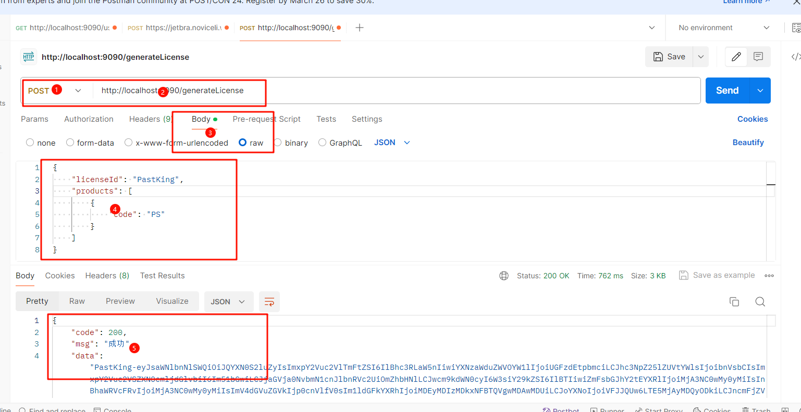

## 使用方法

配合 [此帖子利用ja-netfilter轻松激活IDE开发工具和插件_昔尘源分享](http://www.ltde.cn/posts/30b3c6ab.html)

## 开发工具

- IntelliJ IDEA 2023.2.2

## 主要项目结构
```
src
├── main
│   ├── java
│   │   └── com
│   │       └── example
│   │           ├── controller
│   │           │   └── LicenseController.java
│   │           ├── entity
│   │           │   ├── LicensePart.java
│   │           │   └── Product.java
│   │           └── utils
│   │           │   ├── CertificateGenerator.java
│   │           │   └── PowerConfRuleGen.java
│   └── resources
│       └── application.properties
└── test
    └── java
        └── com
            └── example
                └── controller
                    └── LicenseControllerTest.java
```

## 接口使用方法
1. 生成许可证接口
- URL: `/generateLicense` 
- 请求方法: POST
- 请求参数:
```
{
    "licenseId": "PastKing-Yi",
    "products": [
        {
            "code": "PS"
        },
        {
        	"code" : "II"
        }
    ]
}
```
- 返回示例:
```
{
    "code": "200",
    "message": "Success",
    "data": "PastKing-Yi-eyJsaWNlbnNlSWQiOiJQYXN0S2luZy1ZaSIsImNvZGUiOlsiUFMiXSwiZGF0ZSI6IjIwOTktMTIiLCJzaWciOiJmN2E4NmVlMWMxNzVlMDkyZTlmMTgwN2I1MTQ3NzBmOTU0YjlkZGEyZGYyOWM3ZDlhZjcyZjU2NzNlYmI4ZGY0IiwiaXNzdWVyU2VydmljZUdyb3VwcyI6IlJlYWQiLCJzaWciOiJSU0EifQ=="
}
```
## 部署计划
部署到服务器上时，将使用服务器上的文件路径而不是本地路径，以确保能够正确加载证书和私钥文件。
将生成的许可证文件保存到服务器上的安全目录中，以便应用程序能够访问并提供给客户端。
应该先执行src/main/java/com/example/utils/CertificateGenerator.java生成证书，把项目工程中的证书地址替换成自己的，然后执行src/main/java/com/example/utils/PowerConfRuleGen.java生成EQUAL,x,y,z->r，最后启动工程访问接口即可



## 下载地址(方便的话点一点star)

Gitee：[基于ja-netfilter开发的Jetbrains激活接口: 基于ia-netfilter开发的后端接口，一键激活Jetbrains - Gitee.com 139](https://gitee.com/past-dust/ja-getLicense/tree/master/)
GitHub：[GitHub - PastKing/Jetbrains-Key: 基于ia-netfilter开发的后端接口，一键激活Jetbrains](https://github.com/PastKing/Jetbrains-Key)

