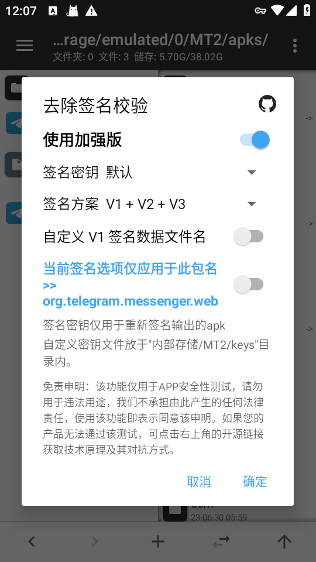
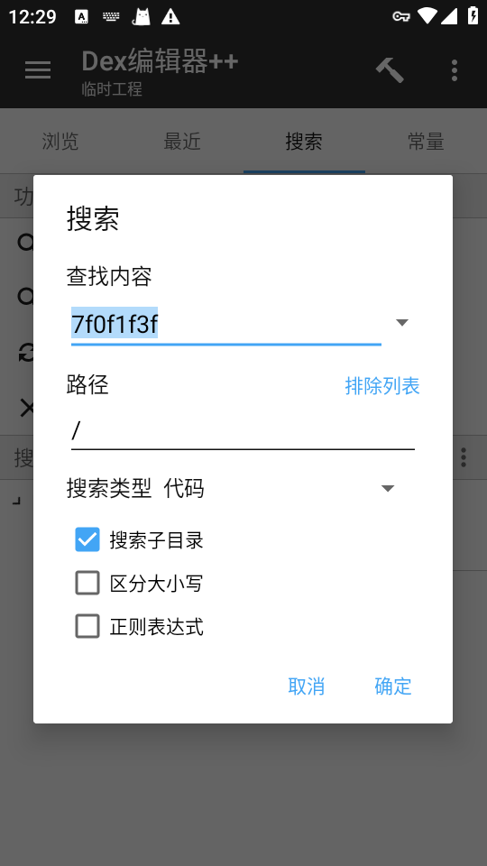
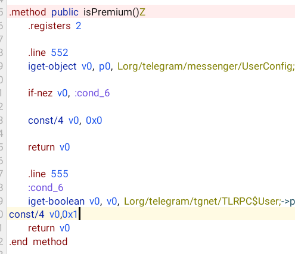
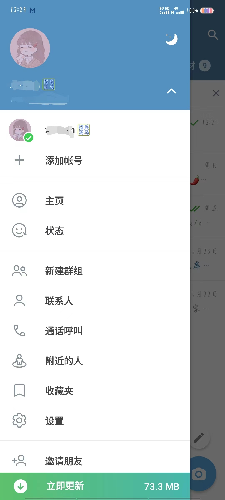

# 「Android逆向开发」Telegram_V10.14.2最新破解教程+安装包，解锁Business/Premium大会员

先去下载最新版

https://desktop.telegram.org/

## 开发工具

- Mt管理器/Np管理器

## 开发环境

- root虚拟机（非root真机也可以）

## 教程开始

### 去除签名校验

老办法，提取安装包->功能->去除签名校验



随后会生成一个`kill`的安装包，我们之后的操作都基于此安装包

### Business/Preminum分析

点击安装包 -> 查看 ->找到resources.arsc文件，选择`Asc编辑器` 不要选择++

搜索资源值：`Telegram Business`

搜索结果有四个值，自己可以翻译一下。我们需要第四个，长按`复制ID`

然后退出，回到`查看`的页面，选择任意dex文件，打开方式为：`Dex编辑器++`

全选，确定，搜索，我们复制到ID粘贴上去。



只有一个结果，点进去，随后点击上面指南针的按钮

长按当前所选->查找调用处->仅查找get调用，还是只有一个结果，进去之后复制关键字`TelegramBusinessSubtitleTemp`方便搜索

我这边给大家转Java看一下(这个片段是TelegramBusinessSubtitleTemp字段所在的方法)

```java
public void updateText() {
    if (PremiumPreviewFragment.access$1400(this.this$0) == 0) {
        this.titleView.setText(LocaleController.getString(PremiumPreviewFragment.access$3000(this.this$0) ? R.string.TelegramPremiumSubscribedTitle : R.string.TelegramPremium));
        this.subtitleView.setText(AndroidUtilities.replaceTags(LocaleController.getString((this.this$0.getUserConfig().isPremium() || PremiumPreviewFragment.access$3000(this.this$0)) ? R.string.TelegramPremiumSubscribedSubtitle : R.string.TelegramPremiumSubtitle)));
    } else if (PremiumPreviewFragment.access$1400(this.this$0) == 1) {
        this.titleView.setText(LocaleController.getString(PremiumPreviewFragment.access$3000(this.this$0) ? R.string.TelegramPremiumSubscribedTitle : R.string.TelegramBusiness));
        this.subtitleView.setText(AndroidUtilities.replaceTags(LocaleController.getString((this.this$0.getUserConfig().isPremium() || PremiumPreviewFragment.access$3000(this.this$0)) ? R.string.TelegramBusinessSubscribedSubtitleTemp : R.string.TelegramBusinessSubtitleTemp)));
    }
    this.subtitleView.getLayoutParams().width = Math.min(AndroidUtilities.displaySize.x - AndroidUtilities.dp(42.0f), HintView2.cutInFancyHalf(this.subtitleView.getText(), this.subtitleView.getPaint()));
    boolean z = PremiumPreviewFragment.access$3000(this.this$0) || BuildVars.IS_BILLING_UNAVAILABLE || this.this$0.subscriptionTiers.size() <= 1;
    if (!this.setTierListViewVisibility || !z) {
        this.tierListView.setVisibility(z ? 8 : 0);
        this.setTierListViewVisibility = true;
    } else if (this.tierListView.getVisibility() == 0 && z && this.tierListViewVisible == z) {
        RecyclerListView recyclerListView = this.tierListView;
        ValueAnimator duration = ValueAnimator.ofFloat(1.0f, 0.0f).setDuration(250L);
        duration.addUpdateListener(new PremiumPreviewFragment$BackgroundView$.ExternalSyntheticLambda0(this, recyclerListView, duration));
        duration.addListener(new PremiumPreviewFragment$BackgroundView$4(this, recyclerListView));
        duration.setInterpolator(CubicBezierInterpolator.DEFAULT);
        duration.start();
    }
    this.tierListViewVisible = !z;
}
```

从方法名可以看到是，这应该是更新某个text的方法，那我们为什么要看这个呢？别急，我们分析一下

#### 简单分析

- 上来有一个判断根据**PremiumPreviewFragment.access\$1400(this.this\$0)**  的值来显示一段文本，好吧，没啥用，继续向下分析。

- 随后`this.subtitleView.getLayoutParams().width = Math.min(AndroidUtilities.displaySize.x - AndroidUtilities.dp(42.0f), HintView2.cutInFancyHalf(this.subtitleView.getText(), this.subtitleView.getPaint()));`这里我们看到width就应该知道也是没什么的代码，调整某个宽度。
- 随后是一个布尔值的`z` 根据这个`z`的值貌似是调整`tierListView`进而操作某个布局的显示。

啊这，初步分析都没有用。

#### 详细分析

根据我们简单的分析呢，可以看到几个比较关键的方法：

```
access$1400
isPremium
access$3000
```

为什么选择这几个呢，原因是：出现的频率高、出现的地方都在关键位置

先不管access$1400是0还是1，看看里面的代码干什么的，这里我截选的`PremiumPreviewFragment.access$1400(this.this$0) == 1`

```java
this.titleView.setText(LocaleController.getString(
    PremiumPreviewFragment.access$3000(this.this\$0) ? R.string.TelegramPremiumSubscribedTitle : R.string.TelegramBusiness
));
this.subtitleView.setText(AndroidUtilities.replaceTags(
    LocaleController.getString((this.this\$0.getUserConfig().isPremium() || PremiumPreviewFragment.access$3000(this.this\$0)) ? R.string.TelegramBusinessSubscribedSubtitleTemp : R.string.TelegramBusinessSubtitleTemp)
));
```

这里面都运用的三元运算符

还记得我们最开始复制的`TelegramBusinessSubscribedSubtitleTemp`它对应的字符可是是`Telegram Business`啊

```
LocaleController.getString((this.this\$0.getUserConfig().isPremium() || PremiumPreviewFragment.access\$3000(this.this\$0)) ? R.string.TelegramBusinessSubscribedSubtitleTemp : R.string.TelegramBusinessSubtitleTemp)
```

`this.this\$0.getUserConfig().isPremium()`和`PremiumPreviewFragment.access\$3000(this.this\$0)` 只要一个为True就会返回`R.string.TelegramBusinessSubscribedSubtitleTemp`也就是显示`Telegram Business`，在根据我们的常识和翻译结果。

先看看`isPremium()`如何实现

```
.method public isPremium()Z
    .registers 2

    .line 552
    iget-object v0, p0, Lorg/telegram/messenger/UserConfig;->currentUser:Lorg/telegram/tgnet/TLRPC$User;

    if-nez v0, :cond_6

    const/4 v0, 0x0

    return v0

    .line 555
    :cond_6
    iget-boolean v0, v0, Lorg/telegram/tgnet/TLRPC$User;->premium:Z

    return v0
.end method
```

转Java

```java
public boolean isPremium() {
    TLRPC.User user = this.currentUser;
    if (user == null) {
    	return false;
    }
    return user.premium;
}
```

OK，我们赋值为True，在return v0之前添加`const/4 v0,0x1`



再看`access\$3000`

```
.method static synthetic access$3000(Lorg/telegram/ui/PremiumPreviewFragment;)Z
    .registers 1

    .line 126
    iget-boolean p0, p0, Lorg/telegram/ui/PremiumPreviewFragment;->forcePremium:Z

    return p0
.end method
```

额，没看懂，不重要，既然有判断access$3000为真，那就直接赋值，参考上面，在return p0上面添加`const/4 p0,0x1`

最后退出，自动签名，安装最新安装包即可。

**至于access$1400用不用修改赋值为1还是0并不影响使用，我都尝试过了。**

### 真机效果图


### 安装包
直连下载：https://pan.ltde.cn/s/khzajp

## 题外说明

部分功能是没办法使用的，我没有全部尝试。至少调整分组、去广告是好用的。



小贴纸设置上很快会消失，其他功能自测吧！