# 乐播视频
现在这个名字容易误会，以为是个播放器，但其实是一个看视频的资源软件。（秒播，没有站点的可以试试）


## 教程开始
工具：Mt管理器/Np管理器
**手机写教程有点麻烦，非重要步骤就省略了**

## 提取安装包
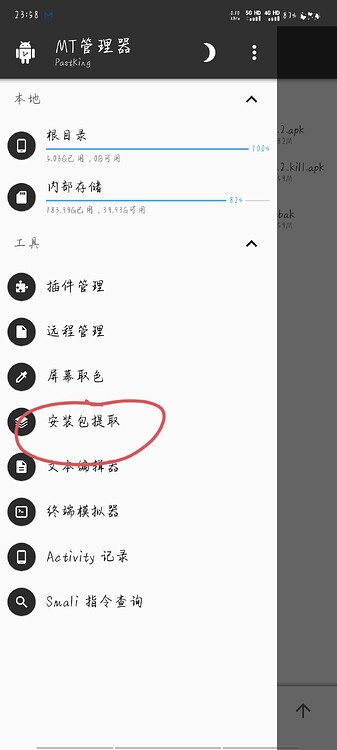

选择今天的主角：乐播视频
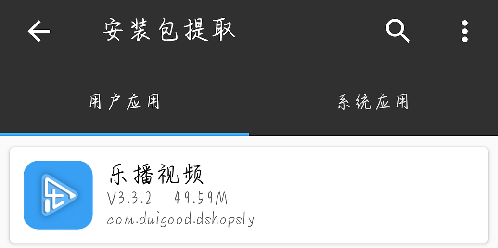
去除签名校验
点击安装包-功能-去除签名校验


这是我选择的方案
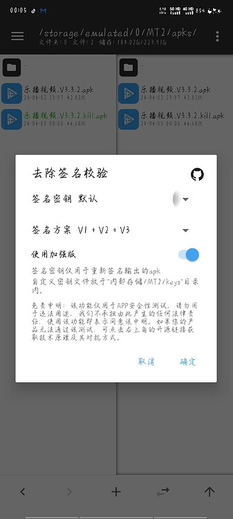

会生成一个乐播视频_V3.3.2_kill.apk安装包，把这个安装。
## 去广告
随后点击左上角，打开activity记录，成功启动服务会有一个小框框出现。
然后启动乐播视频进入首页之后，回到Mt管理器，会看到这样的一个异常activity
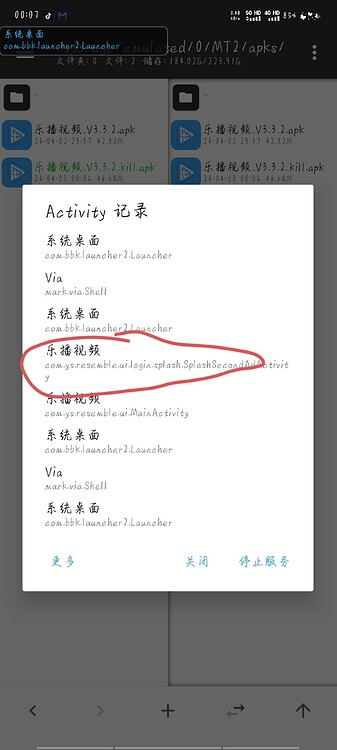

单击之后即可复制。
然后关闭这个activity记录服务，单击乐播视频_V3.3.2_kill.apk会看到查看按钮，点击之后进入。
单击任意一个dex文件
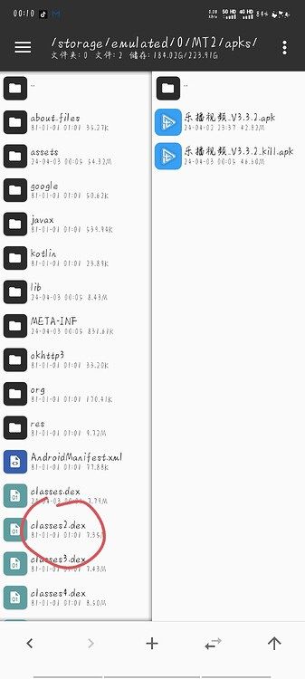

选择**Dex编辑器++** ，全选之后确定。
然后点击搜索，发起新的搜索，内容就是刚才复制的异常activity。
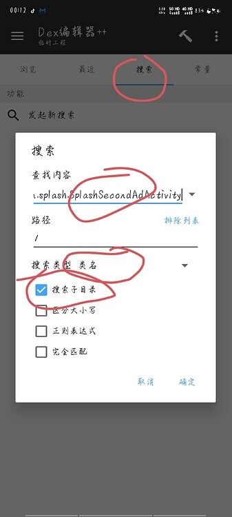

搜索结果，第一个，点击进入。（看不懂没关系）
我这边给大家转化Java看一下。
```Java
//
// Decompiled by Jadx - 738ms
//
package com.ys.resemble.ui.login.splash;

import android.app.Activity;
import android.os.Bundle;
import android.os.Handler;
import android.view.KeyEvent;
import android.view.View;
import android.widget.FrameLayout;
import androidx.core.app.ActivityCompat;
import androidx.core.content.ContextCompat;
import com.moqi.sdk.manager.splash.MQSplashAdView;
import com.ys.resemble.app.AppApplication;
import com.ys.resemble.app.BaseActivity;
import com.ys.resemble.app.O000000o;
import com.ys.resemble.databinding.ActivitySecondAdSplashBinding;
import com.ys.resemble.entity.AdInfoDetailEntry;
import com.ys.resemble.ui.MainActivity;
import com.ys.resemble.ui.login.SelectorSexActivity;
import com.ys.resemble.util.O00OoO0o;
import java.lang.ref.WeakReference;
import java.util.ArrayList;
import java.util.List;
import me.goldze.mvvmhabit.utils.O000OOo0;

public class SplashSecondAdActivity extends BaseActivity<ActivitySecondAdSplashBinding, SplashSecondAdViewModel> {
    private static final String[] O0000Oo = {"android.permission.ACCESS_FINE_LOCATION", "android.permission.ACCESS_COARSE_LOCATION", "android.permission.READ_PHONE_STATE", "android.permission.WRITE_EXTERNAL_STORAGE"};
    FrameLayout O00000oo;
    View O0000O0o;
    private MQSplashAdView O0000OoO;
    private boolean O0000o;
    private int O0000o0;
    private String O0000o00;
    String O00000o = "test";
    List<String> O00000oO = new ArrayList();
    boolean O0000OOo = false;
    boolean O0000Oo0 = false;
    private AdInfoDetailEntry O0000Ooo = new AdInfoDetailEntry();
    private Handler O0000o0O = new Handler();
    private boolean O0000o0o = false;

    public int O000000o(Bundle bundle) {
        return 0x7f0c0040;
    }

    public int O00000oO() {
        return 12;
    }

    public SplashSecondAdViewModel O00000oo() {
        return new SplashSecondAdViewModel(AppApplication.O00000Oo(), O000000o.O000000o());
    }

    /* JADX WARN: Multi-variable type inference failed */
    protected void onCreate(Bundle bundle) {
        super.onCreate(bundle);
        O000OOo0.O000000o(this, false, 0x7f060024);
    }

    /* JADX WARN: Multi-variable type inference failed */
    public void O0000O0o() {
        String[] strArr;
        super.O0000O0o();
        for (String str : O0000Oo) {
            if (ContextCompat.checkSelfPermission(this, str) != 0) {
                this.O00000oO.add(str);
            }
        }
        this.O0000o = getIntent().getBooleanExtra("flag", false);
        this.O0000Ooo = getIntent().getSerializableExtra("adInfoDetailEntry");
        this.O00000oo = (FrameLayout) findViewById(0x7f090197);
        WeakReference weakReference = new WeakReference(this);
        this.O0000O0o = findViewById(0x7f090905);
        AdInfoDetailEntry adInfoDetailEntry = this.O0000Ooo;
        if (adInfoDetailEntry != null) {
            this.O0000o00 = adInfoDetailEntry.getSdk_ad_id();
            this.O0000o0 = this.O0000Ooo.getAd_id();
            MQSplashAdView mQSplashAdView = new MQSplashAdView((Activity) weakReference.get(), this.O0000o00 + "", this.O00000oo);
            this.O0000OoO = mQSplashAdView;
            mQSplashAdView.setSplashAdCallBack(new SplashSecondAdActivity$1(this));
            this.O00000oo.addView(this.O0000OoO);
            if (!this.O00000oO.isEmpty()) {
                List<String> list = this.O00000oO;
                ActivityCompat.requestPermissions(this, (String[]) list.toArray(new String[list.size()]), 1);
            } else {
                this.O0000OoO.loadAd();
            }
        } else if (!this.O0000o) {
            O0000o0o();
        } else {
            finish();
        }
        O0000o0();
    }

    public void onRequestPermissionsResult(int i, String[] strArr, int[] iArr) {
        super.onRequestPermissionsResult(i, strArr, iArr);
        if (isFinishing() || i != 1) {
            return;
        }
        this.O0000OoO.loadAd();
    }

    protected void onResume() {
        super.onResume();
        this.O0000OOo = true;
        O0000o0O();
    }

    protected void onPause() {
        super.onPause();
        this.O0000OOo = false;
    }

    protected void onDestroy() {
        super.onDestroy();
        this.O0000o0O.removeCallbacksAndMessages(null);
        this.O0000o0O = null;
        MQSplashAdView mQSplashAdView = this.O0000OoO;
        if (mQSplashAdView != null) {
            mQSplashAdView.destroy();
        }
    }

    public boolean onKeyDown(int i, KeyEvent keyEvent) {
        if (i == 4 || i == 3) {
            return true;
        }
        return super.onKeyDown(i, keyEvent);
    }

    public void O0000o0() {
        this.O0000o0O.postDelayed(new SplashSecondAdActivity$2(this), 3500L);
    }

    public void O0000o0O() {
        if (!O0000OoO() && this.O0000OOo && this.O0000Oo0) {
            this.O0000OOo = false;
            if (!this.O0000o) {
                O0000o0o();
            } else {
                finish();
            }
        }
    }

    public void O0000o0o() {
        if (O0000OoO()) {
            return;
        }
        if (O00OoO0o.O000o00o() == 1) {
            startActivity(MainActivity.class);
            finish();
            return;
        }
        startActivity(SelectorSexActivity.class);
        finish();
    }

    public void O0000Oo0() {
        super.O0000Oo0();
        if (me.goldze.mvvmhabit.base.O000000o.O000000o().O00000oO() == this) {
            O0000Ooo();
        }
    }

    public void O0000Oo() {
        super.O0000Oo();
        me.goldze.mvvmhabit.base.O000000o.O000000o().O0000Oo();
    }
}
```
可以看到O0000O0o的方法里面，存在这样的赋值操作
```Java
this.O0000o00 = adInfoDetailEntry.getSdk_ad_id();
            this.O0000o0 = this.O0000Ooo.getAd_id();
```
这就是获取广告SDK的操作。
回到正题这回，我们点击右上角，搜索getSdk_ad_id，之后长按这个区域，会出现＞＞的框，点击跳转
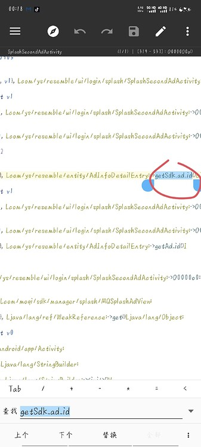
```
.method public getSdk_ad_id()Ljava/lang/String;
    .registers 2

    .line 89
    iget-object v0, p0, Lcom/ys/resemble/entity/AdInfoDetailEntry;->sdk_ad_id:Ljava/lang/String;

    return-object v0
.end method
```
这个方法主要是返回一个Sting类型的值，我们在return之前放上我们的值

`const-string v0, "null"` 
理论上不止null什么都可以，只要不是他要的就行。
然后保存退出
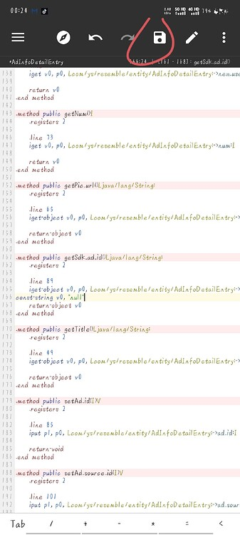

确定
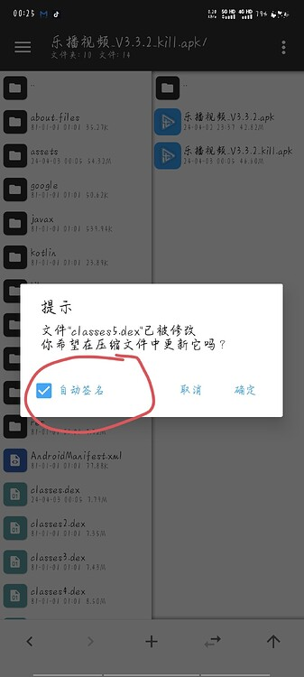

然后重新安装就会发现，广告没了！就很好，嘻嘻:grin:
## 会员显示
下面是我以前写的博客，图片直接用了，就不带着做了。
直接搜索方法名：`getIs_vip` 
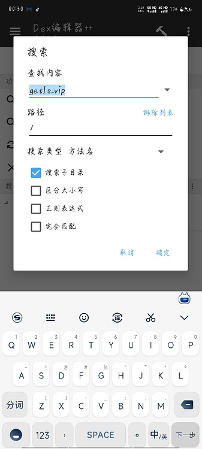
给他来个永为“真”
```
const/4 v0,0x1
```
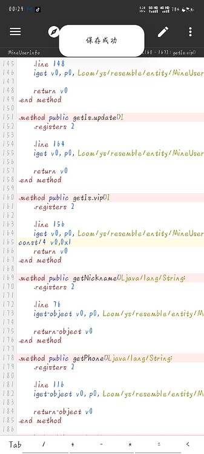
邀请人数自定义
这里就不带图片了
直接搜方法名：`getInvited_count`
有两个结果，都修改一下
修改格式为
```
const v0, 0x270f
```
这里的0x270f是十六进制，想修改多少邀请就用十进制去转化。

总结
手机编写真的累，还有
最后，建议大家登录账号使用，随便注册一下就行。
这里提供一下原包，成品包，去签名包。
下载地址：https://xcyp.lanzoui.com/b05f5zmsb
提取码 : 4s48