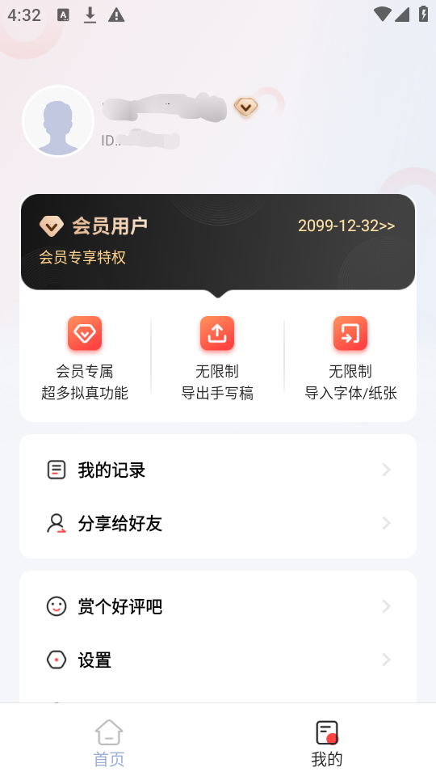

# 「Android逆向开发」手写生成器_V1.7.2最新版破解教程+安装包

先去下载最新版：

https://sxscq.pengtu.net/

## 开发工具

- Mt管理器/Np管理器
- DITOR

## 开发环境

- root虚拟机（真机root主要是脱壳）

## 教程开始


提取安装包的时候发现有`腾讯御安全`的壳，

### 脱壳参考如下

以前的帖子

### 会员分析

这次不那么细了，跟不上可以去参考以前的帖子。

直接用`常量大法`，到常量这里搜索`会员`


会出现五个结果，后面四个选哪个点进去都可以。我这里以最后一个为例

其所在的 invoke 方法如下：(后面如无特色情况就直接用转Java代码了)

```
.method public final invoke()Lnet/pengtu/sxscq/dialog/ExportDialog;
    .registers 10

    .line 200
    new-instance v8, Lnet/pengtu/sxscq/dialog/ExportDialog;

    .line 201
    iget-object v0, p0, Lnet/pengtu/sxscq/activity/PaperActivity$exportDialog$2;->this$0:Lnet/pengtu/sxscq/activity/PaperActivity;

    invoke-static {v0}, Lnet/pengtu/sxscq/activity/PaperActivity;->access$getMActivity$p$s-1612100453(Lnet/pengtu/sxscq/activity/PaperActivity;)Landroidx/appcompat/app/AppCompatActivity;

    move-result-object v0

    const-string v1, "mActivity"

    invoke-static {v0, v1}, Lkotlin/jvm/internal/Intrinsics;->checkNotNullExpressionValue(Ljava/lang/Object;Ljava/lang/String;)V

    move-object v1, v0

    check-cast v1, Landroid/content/Context;

    .line 204
    iget-object v0, p0, Lnet/pengtu/sxscq/activity/PaperActivity$exportDialog$2;->this$0:Lnet/pengtu/sxscq/activity/PaperActivity;

    invoke-static {v0}, Lnet/pengtu/sxscq/activity/PaperActivity;->access$getInitViewModel$p(Lnet/pengtu/sxscq/activity/PaperActivity;)Lnet/pengtu/sxscq/vm/InitViewModel;

    move-result-object v0

    if-nez v0, :cond_1e

    const-string v0, "initViewModel"

    invoke-static {v0}, Lkotlin/jvm/internal/Intrinsics;->throwUninitializedPropertyAccessException(Ljava/lang/String;)V

    const/4 v0, 0x0

    :cond_1e
    iget-object v0, v0, Lnet/pengtu/sxscq/vm/InitViewModel;->buy_btn_vip_tips:Landroidx/databinding/ObservableField;

    invoke-virtual {v0}, Landroidx/databinding/ObservableField;->get()Ljava/lang/Object;

    move-result-object v0

    invoke-static {v0}, Ljava/lang/String;->valueOf(Ljava/lang/Object;)Ljava/lang/String;

    move-result-object v4

    .line 205
    iget-object v0, p0, Lnet/pengtu/sxscq/activity/PaperActivity$exportDialog$2;->this$0:Lnet/pengtu/sxscq/activity/PaperActivity;

    new-instance v5, Lnet/pengtu/sxscq/activity/PaperActivity$exportDialog$2$$ExternalSyntheticLambda0;

    invoke-direct {v5, v0}, Lnet/pengtu/sxscq/activity/PaperActivity$exportDialog$2$$ExternalSyntheticLambda0;-><init>(Lnet/pengtu/sxscq/activity/PaperActivity;)V

    sget-object v6, Lnet/pengtu/sxscq/activity/PaperActivity$exportDialog$2$$ExternalSyntheticLambda2;->INSTANCE:Lnet/pengtu/sxscq/activity/PaperActivity$exportDialog$2$$ExternalSyntheticLambda2;

    iget-object v0, p0, Lnet/pengtu/sxscq/activity/PaperActivity$exportDialog$2;->this$0:Lnet/pengtu/sxscq/activity/PaperActivity;

    new-instance v7, Lnet/pengtu/sxscq/activity/PaperActivity$exportDialog$2$$ExternalSyntheticLambda1;

    invoke-direct {v7, v0}, Lnet/pengtu/sxscq/activity/PaperActivity$exportDialog$2$$ExternalSyntheticLambda1;-><init>(Lnet/pengtu/sxscq/activity/PaperActivity;)V

    const-string v2, "普通用户仅可导出第一页，<strong><font color=#242424>开通会员后无限制导出全部内容</font></strong>"

    const-string v3, "导出提示"

    move-object v0, v8

    .line 200
    invoke-direct/range {v0 .. v7}, Lnet/pengtu/sxscq/dialog/ExportDialog;-><init>(Landroid/content/Context;Ljava/lang/String;Ljava/lang/String;Ljava/lang/String;Lio/reactivex/functions/Action;Lio/reactivex/functions/Action;Lio/reactivex/functions/Action;)V

    return-object v8
.end method

```

转Java

```java
public final ExportDialog invoke() {
    Context context = PaperActivity.access$getMActivity$p$s-1612100453(this.this$0);
    Intrinsics.checkNotNullExpressionValue(context, "mActivity");
    Context context2 = context;
    InitViewModel access$getInitViewModel$p = PaperActivity.access$getInitViewModel$p(this.this$0);
    if (access$getInitViewModel$p == null) {
        Intrinsics.throwUninitializedPropertyAccessException("initViewModel");
        access$getInitViewModel$p = null;
    }
    return new ExportDialog(context2, "普通用户仅可导出第一页，<strong><font color=#242424>开通会员后无限制导出全部内容</font></strong>", "导出提示", String.valueOf(access$getInitViewModel$p.buy_btn_vip_tips.get()), new PaperActivity$exportDialog$2$.ExternalSyntheticLambda0(this.this$0), PaperActivity$exportDialog$2$.ExternalSyntheticLambda2.INSTANCE, new PaperActivity$exportDialog$2$.ExternalSyntheticLambda1(this.this$0));
}

```

看最后返回的`ExportDialog`对象的第四个参数的第一个参数`access$getInitViewModel$p.buy_btn_vip_tips.get()`

我们找到`buy_btn_vip_tips`跳转过去，看到他存在在一个初始化方法里面。

```java
public void InitData(InitResp initBean) {
    if (initBean != null) {
        this.initUpdate.postValue(initBean.getUpdate());
        this.share.set(initBean.getShare());
        this.isLogin.set(initBean.getUserInfo() != null);
        this.login.postValue(Boolean.valueOf(initBean.getUserInfo() != null));
        this.buy_vip_tips.set(initBean.getBuy_vip_tips());
        this.paper_upper_limit.set(initBean.getPaper_upper_limit());
        this.font_upper_limit.set(initBean.getFont_upper_limit());
        this.free_upper_limit.set(initBean.getFree_upper_limit());
        this.buy_btn_vip_tips.set(initBean.getBuy_vip_btn_tips());
        this.on_quick_login.postValue(Boolean.valueOf(initBean.getOn_quick_login() == 1));
        if (initBean.getUserInfo() != null) {
            this.nickname.set(initBean.getUserInfo().getNickname());
            this.avatar.set(initBean.getUserInfo().getAvatar());
            this.uid.set(initBean.getUserInfo().getUid());
            this.vip.postValue(Boolean.valueOf(initBean.getUserInfo().getUser_type() == 1));
            SPUtils.getInstance().put("VIP", initBean.getUserInfo().getUser_type() == 1);
            this.isVip.set(initBean.getUserInfo().getUser_type() == 1);
            this.user_type_str.set(initBean.getUserInfo().getUser_type_str());
            this.expire_time_str.set(initBean.getUserInfo().getExpire_time_str());
            return;
        }
        this.isVip.set(false);
    }
}
```

注意`initBean.getUserInfo() != null`以下的部分，继续跳转，这次我们跳转该方法的参数`InitResp`

再次转Java

```java
//
// Decompiled by Jadx - 619ms
//
package net.pengtu.sxscq.datasource.http.resp;

import net.pengtu.sxscq.bean.InitShare;
import net.pengtu.sxscq.bean.InitUpdate;
import net.pengtu.sxscq.bean.UserInfo;

public class InitResp {
    private String buy_vip_btn_tips;
    private String buy_vip_tips;
    private int font_upper_limit;
    private int free_upper_limit;
    private int on_duomaomao_mode;
    private int on_quick_login;
    private int paper_upper_limit;
    private InitShare share;
    private InitUpdate update;
    private UserInfo userinfo;

    public int getFree_upper_limit() {
        return this.free_upper_limit;
    }

    public void setFree_upper_limit(int free_upper_limit) {
        this.free_upper_limit = free_upper_limit;
    }

    public int getOn_quick_login() {
        return this.on_quick_login;
    }

    public void setOn_quick_login(int on_quick_login) {
        this.on_quick_login = on_quick_login;
    }

    public String getBuy_vip_btn_tips() {
        return this.buy_vip_btn_tips;
    }

    public void setBuy_vip_btn_tips(String buy_vip_btn_tips) {
        this.buy_vip_btn_tips = buy_vip_btn_tips;
    }

    public int getOn_duomaomao_mode() {
        return this.on_duomaomao_mode;
    }

    public void setOn_duomaomao_mode(int on_duomaomao_mode) {
        this.on_duomaomao_mode = on_duomaomao_mode;
    }

    public int getPaper_upper_limit() {
        return this.paper_upper_limit;
    }

    public void setPaper_upper_limit(int paper_upper_limit) {
        this.paper_upper_limit = paper_upper_limit;
    }

    public int getFont_upper_limit() {
        return this.font_upper_limit;
    }

    public void setFont_upper_limit(int font_upper_limit) {
        this.font_upper_limit = font_upper_limit;
    }

    public String getBuy_vip_tips() {
        return this.buy_vip_tips;
    }

    public void setBuy_vip_tips(String buy_vip_tips) {
        this.buy_vip_tips = buy_vip_tips;
    }

    public UserInfo getUserInfo() {
        return this.userinfo;
    }

    public void setUserInfo(UserInfo userInfo) {
        this.userinfo = userInfo;
    }

    public InitUpdate getUpdate() {
        return this.update;
    }

    public void setUpdate(InitUpdate update) {
        this.update = update;
    }

    public InitShare getShare() {
        return this.share;
    }

    public void setShare(InitShare share) {
        this.share = share;
    }
}

```

OK，应该是找到正主了，继续跳转UserInfo，看看有什么属性

```java
//
// Decompiled by Jadx - 503ms
//
package net.pengtu.sxscq.bean;

public class UserInfo {
    private String app_account_token;
    private String avatar;
    private long expire_time;
    private String expire_time_str;
    private String nickname;
    private String uid;
    private int user_type;
    private String user_type_str;

    public long getExpire_time() {
        return this.expire_time;
    }

    public void setExpire_time(long expire_time) {
        this.expire_time = expire_time;
    }

    public String getUid() {
        return this.uid;
    }

    public void setUid(String uid) {
        this.uid = uid;
    }

    public String getApp_account_token() {
        return this.app_account_token;
    }

    public void setApp_account_token(String app_account_token) {
        this.app_account_token = app_account_token;
    }

    public String getAvatar() {
        return this.avatar;
    }

    public void setAvatar(String avatar) {
        this.avatar = avatar;
    }

    public String getNickname() {
        return this.nickname;
    }

    public void setNickname(String nickname) {
        this.nickname = nickname;
    }

    public int getUser_type() {
        return this.user_type;
    }

    public void setUser_type(int user_type) {
        this.user_type = user_type;
    }

    public String getUser_type_str() {
        return this.user_type_str;
    }

    public void setUser_type_str(String user_type_str) {
        this.user_type_str = user_type_str;
    }

    public String getExpire_time_str() {
        return this.expire_time_str;
    }

    public void setExpire_time_str(String expire_time_str) {
        this.expire_time_str = expire_time_str;
    }
}
```

再次回顾我们的`InitData`方法，参考`initBean.getUserInfo) ≠ null`以下，我删除无用的放到下面给大家看看，

```java
this.vip.postValue(Boolean.valueOf(initBean.getUserInfo().getUser_type() == 1));
SPUtils.getInstance().put("VIP", initBean.getUserInfo().getUser_type() == 1);
this.isVip.set(initBean.getUserInfo().getUser_type() == 1);
this.user_type_str.set(initBean.getUserInfo().getUser_type_str());
this.expire_time_str.set(initBean.getUserInfo().getExpire_time_str());
```

所以我们只需要修改`getUser_type`、`getUser_type_str`、`getExpire_time_str`这三个方法。

修改如下：

```
.method public getExpire_time_str()Ljava/lang/String;
    .registers 2

    .line 81
    iget-object v0, p0, Lnet/pengtu/sxscq/bean/UserInfo;->expire_time_str:Ljava/lang/String;
const-string v0,"2099-12-32"
    return-object v0
.end method

.method public getUser_type()I
    .registers 2

    .line 65
    iget v0, p0, Lnet/pengtu/sxscq/bean/UserInfo;->user_type:I
const/4 v0,0x1
    return v0
.end method

.method public getUser_type_str()Ljava/lang/String;
    .registers 2

    .line 73
    iget-object v0, p0, Lnet/pengtu/sxscq/bean/UserInfo;->user_type_str:Ljava/lang/String;
const-string v0,"VIP"
    return-object v0
.end method
```

### 效果图



### 使用体验


### 下载链接

下载链接：https://www.123pan.com/s/7hX0Vv-izmbv.html

提取码:Mfl9


