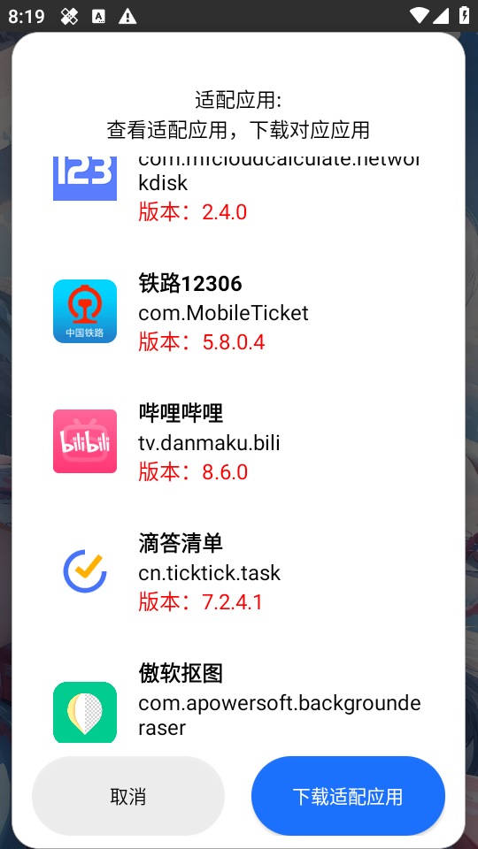
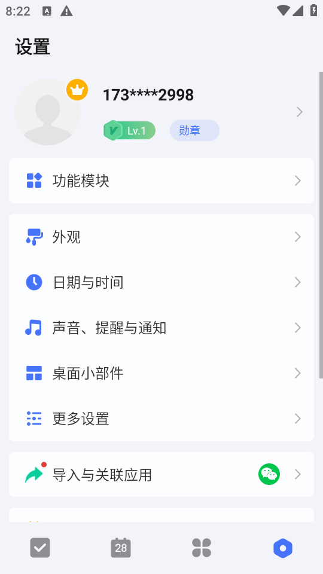

## Hook Tools

注意！模块是免费的！免费的！免费的！请不要贩卖！不要贩卖！

**真诚**、**友善**、**团结**、**专业**，工建优质 Android Hook 模块！

适配软件版本请以模块内适配版本为准！模块更新适配了也需要升级相应的软件版本！部分软件不兼容适配旧版本。

## 支持软件

- 腾讯、穿山甲、快手、百度、小米广告通杀去除
- 快影_6.54.0.654003 —— 解锁会员全部功能
- 傲软抠图_1.8.1 —— 去除会员
- 铁路12306_5.8.0.4 —— 去除开屏广告
- 讯飞语记_7.5.1407 —— 解锁SVIP
- 哔哩哔哩_8.6.0 —— 解锁画质
- 滴答清单_7.2.4.1 —— 解锁会员
- 123云盘_2.4.0 —— 去广告

##  应用介绍

## 效果

## 下载地址
直连：https://pan.ltde.cn/s/egjxvd