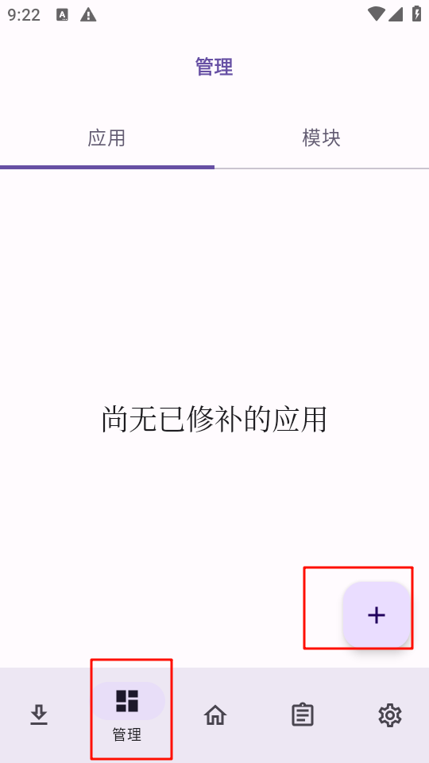
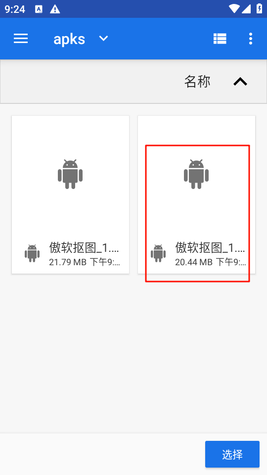
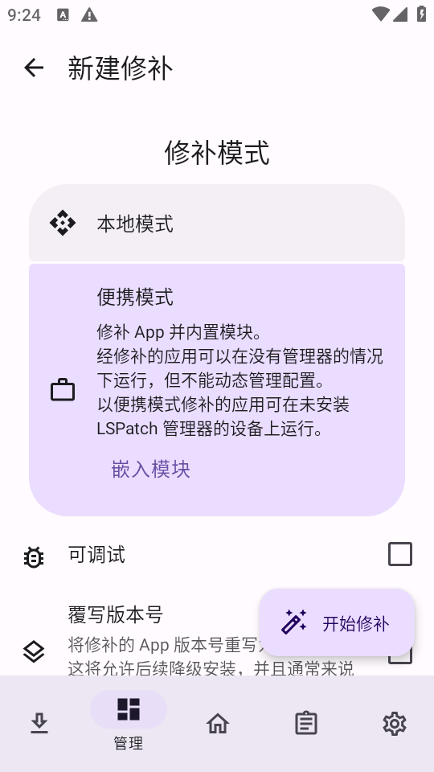
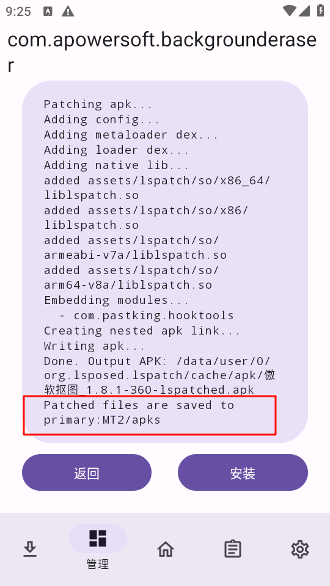
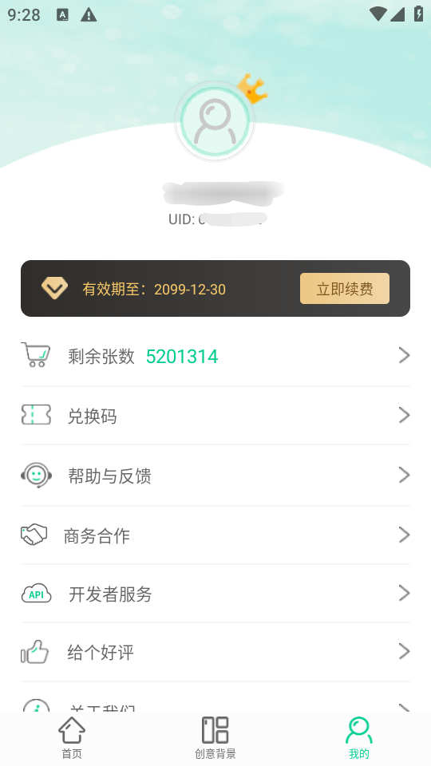

## Xposed模块

## 工具列表
JsHook：https://pan.ltde.cn/s/frrt90
LSPatch：https://pan.ltde.cn/s/8ar6oh
## 教程
本期以`LSPatch`为例，目标软件以`傲软抠图`为例
原则上所有软件通用
### 提取安装包+去签
这步很简单，自行操作
**(带壳的软件不行哦，这步很重要，可以判断这个软件是否可以免Root使用`LSPatch`注入)**
### 修复软件+注入模块
打开`LSPatch`

选择去签的包

选择便携嵌入，并选中我们的Xposed模块

然后点击开始修复
修复成功之后会告诉你修复完之后的apk目录

`Patched files are saved toprimary: MT2/apks`
修复完的包名比较明显
安装修复完的安装包

随后打开软件，就会发现，已经成功

