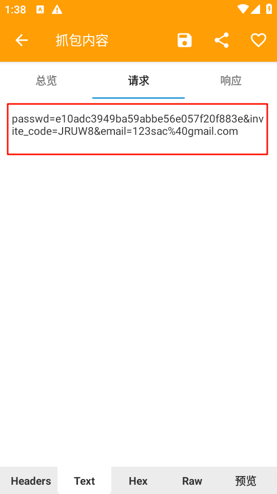
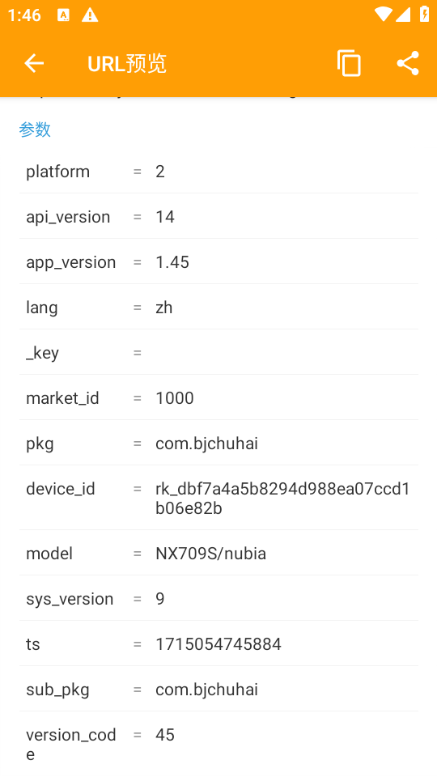
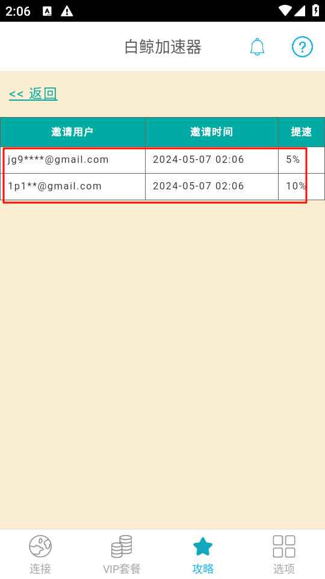

官网：[白鲸加速器 - 永远能连上的VPN (bjch123.com) 66](https://www.bjch123.com/)
支持Win/Mac/IOS/Android多客户端，账号通用
已测试Win和Android正常

## 开发工具
- ide
- 黄鸟
## 抓包分析

打开疑似目标的请求

会看到他的请求体竟然是明文
经检测，只需要注册登录时候填写你的邀请码就算你邀请的（直接延长一个月天数）

那这样，目标就很明确了
照着抄呗

我们先把Url参数和请求体拿出来
```
url = "https://wa01.googla.org/account/register"
params = {
    "platform": "2",
    "api_version": "14",
    "app_version": "1.45",
    "lang": "zh",
    "_key": "",
    "market_id": "1000",
    "pkg": "com.bjchuhai",
    "sys_version": "13",
    "ts": "1714675386019",
    "sub_pkg": "com.bjchuhai",
    "version_code": "45",
}

body = {
    "passwd": "31eeca8fa1484673311de3602ced6e5c",
    "invite_code": "JRUW8",
    "email": "fsdv42ds@gamil.com"
}

response = requests.post(url, params=params, data=body)
```

当然这样肯定是不行的，继续完善一下，把可能存在校验的地方全部修改
```Python
import requests
import time
import random
import string

def ranEmail():
    random_str = ''.join(random.choice(string.ascii_lowercase + string.digits) for _ in range(random.randint(5, 8)))
    email = random_str + "@gmail.com"
    return email

def ranDeviceId():
    device_id = ''.join(random.choice(string.ascii_lowercase + string.digits) for _ in range(len("rk_dbf7a4a5b8294d988ea07ccd1b06e82b")))
    return device_id

url = "https://co01.jurasic.net/account/register"

params = {
    "platform": "2",
    "api_version": "14",
    "app_version": "1.45",
    "lang": "zh",
    "_key": "",
    "market_id": "1000",
    "pkg": "com.bjchuhai",
    "device_id": ranDeviceId(),  # 使用随机生成的device_id
    "model": "NX709S/nubia",
    "sys_version": "9",
    "ts": str(int(time.time() * 1000)),  # 使用当前的时间戳
    "sub_pkg": "com.bjchuhai",
    "version_code": "45"
}

body = {
    "passwd": "e10adc3949ba59abbe56e057f20f883e",
    "invite_code": "JRUW8",
    "email": ranEmail()
}

response = requests.post(url, params=params, data=body)

print("Status Code:", response.status_code)
print("Response Text:", response.text)
```

这样看着就好了，测试一下，OK可以

在给代码加一层循环和延迟，以下就是完整代码
```Python
import requests
import time
import random
import string

def ranEmail():
    random_str = ''.join(random.choice(string.ascii_lowercase + string.digits) for _ in range(random.randint(5, 8)))
    email = random_str + "@gmail.com"
    return email

def ranDeviceId():
    device_id = ''.join(random.choice(string.ascii_lowercase + string.digits) for _ in range(len("rk_dbf7a4a5b8294d988ea07ccd1b06e82b")))
    return device_id

url = "https://co01.jurasic.net/account/register"

if __name__ == "__main__":
    for i in range(20):
        params = {
            "platform": "2",
            "api_version": "14",
            "app_version": "1.45",
            "lang": "zh",
            "_key": "",
            "market_id": "1000",
            "pkg": "com.bjchuhai",
            "device_id": ranDeviceId(),
            "model": "NX709S/nubia",
            "sys_version": "9",
            "ts": str(int(time.time() * 1000)),
            "sub_pkg": "com.bjchuhai",
            "version_code": "45"
        }

        body = {
            "passwd": "e10adc3949ba59abbe56e057f20f883e",
            "invite_code": "你的邀请码",
            "email": ranEmail()
        }

        response = requests.post(url, params=params, data=body)
        time.sleep(random.uniform(2, 3))
        print("Status Code:", response.status_code)
        print("Response Text:", response.text)
```


使用的时候记得把invite_code 改成自己的，大家轻点薅吧，薅秃了失效就不好了
