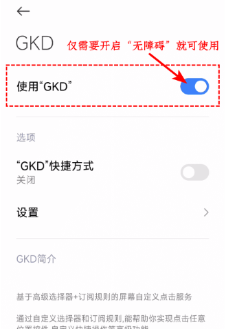
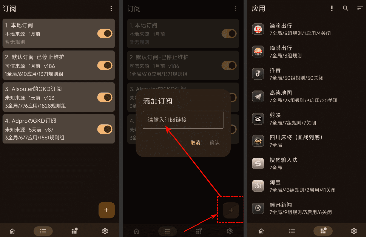
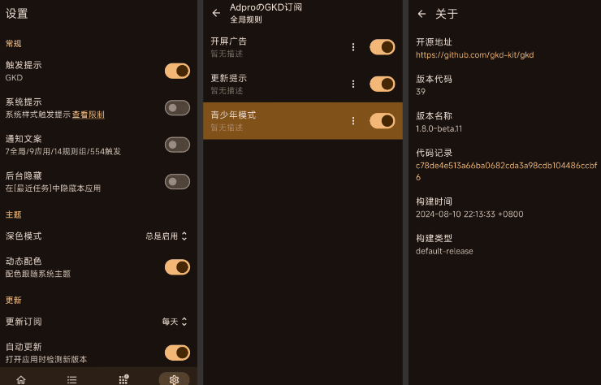

## 介绍

众所周知，去年，李跳跳遭到“绿尸函”攻击后都选择了无奈下架。
今天给大家安利这款开屏跳过APP广告很强大，它和李跳跳这类APP不一样，是基于应用跳过规则订阅的方式实现跳开屏，你可以理解为跳过开屏界的“TVb0x”。

每个APP的开屏广告可能不一样，对应的跳过规则也会不一样，于是有网友针对目前热门的APP跳开屏规则进行编写和整理并分享到出来，订阅了这些规则，就可以更大范围跳过对应的APP开屏广告。

订阅规则有能力的都可以参与进行制作，这就和“开源阅读”，“TVb0x”等一样，大家可以共建各类优质“源”，任何开屏都逃不过。


**于是我又找了一款自动跳过广告的神器，能帮你更快开应用——GKD**

.webp)

`【特别提醒】` 
GKD是一个基于 无障碍 + 高级选择器 + 订阅规则 的自定义屏幕点击 APP。
开屏跳过APP都必须要开启无障碍服务和后台常驻等才能正常使用。

## 教程







## 订阅规则

**订阅规则接口：**
684个应用的1562个规则组
```https://raw.gitmirror.com/AIsouler/GKD_subscription/main/dist/AIsouler_gkd.json5```

48个应用的170个规则组
```https://registry.npmmirror.com/@aoguai/subscription/latest/files```

621个应用的1402个规则组
```https://raw.gitmirror.com/Adpro-Team/GKD_subscription/main/dist/Adpro_gkd.json5```

## 下载

下载地址：
[https://luojiang.lanzouw.com/b01jrey3af](https://luojiang.lanzouw.com/b01jrey3af#h85x) 密码: h85x
https://www.123pan.com/s/sXtA-eAdkh
