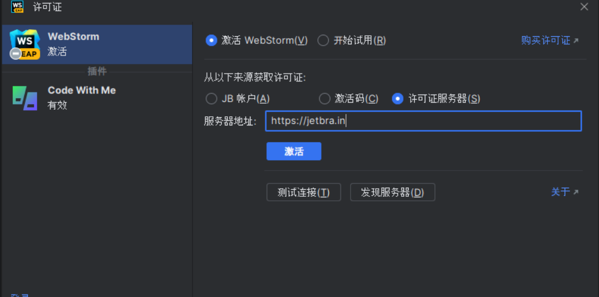

可能很多人没听过ja-netfilter。ja-netfilter是一个用来“简化”编写java-agent的“框架”。之所以给“简化”和“框架”打引号，是因为它既没有多少“简化”，也说不上是“框架”。

## 它有什么用？

从它的名字中就可以看出来，它是一个网络过滤器，可以屏蔽指定规则的网络请求，所以说大家将其理解为一个网络阻断器、网络拦截器更加合适。

在整个激活过程中，它的作用可以看做是欺骗Jetbrains官方，让他永远无法成功的知道你当前使用的激活码到底是不是过期了。

## 下载ja-netfilter

你可以直接下载[ja-netfilter 2022.2](https://gitee.com/ja-netfilter/ja-netfilter/attach_files/1081163/download/ja-netfilter-2022.2.0.zip)或到[项目release页](https://gitee.com/ja-netfilter/ja-netfilter/releases)中寻找合适的版本，解压到合适的位置

## 配置ja-netfilter

打开ja-netfilter\config中的url.conf，内容配置如下
```
[URL]
PREFIX,https://account.jetbrains.com/lservice/rpc/validateKey.action
```
打开ja-netfilter\config中的dns.conf，内容配置如下
```
[DNS]
EQUAL,jetbrains.com;
EQUAL,dbeaver.com
```
如果激活的版本低于2022.2，这一步可以不做 打开ja-netfilter\config中的power.conf，内容配置如下
```
[Args]
[Result]
EQUAL,120506319308405029943033101198259523557651500267734599270782782071425072541184605728867830395125412768750966448411447392137801711908001958831204692561738046570955709184538088569271703484602917023462976408329100293802371486063140115775311907530943821345005598057265747678100463689973450156515895355214983079672467769169324175533323801179755544364921063654340185317077965735659865485150734884110709760680757502730007505995422237875348017761382234951127263548660889969621730944377739766734765769747684457663965611896398862841334032542726392699785677440644859509166466497325071885386505404431787167239320957696896447925472784312642576835792921100239616617639216190447230487878404191838684279341834945197861631446454083984351911070798505031973496634229907567362853550735007045265430703581336189733180744888091740381912913980707537008943084904260746266383019688346709856215660232636334604552145129775009725685598798774376749830567219982166661918408832945395290223853748014160473876195098438959881711585152480525870219408398012002829112863175041709512032251930709608035158747101960447898838942705485214217426612863919268749874079707310181890737049603255938886865558759802593500502795018952114650332765839003032013708006750600413455628536259,65537,860106576952879101192782278876319243486072481962999610484027161162448933268423045647258145695082284265933019120714643752088997312766689988016808929265129401027490891810902278465065056686129972085119605237470899952751915070244375173428976413406363879128531449407795115913715863867259163957682164040613505040314747660800424242248055421184038777878268502955477482203711835548014501087778959157112423823275878824729132393281517778742463067583320091009916141454657614089600126948087954465055321987012989937065785013284988096504657892738536613208311013047138019418152103262155848541574327484510025594166239784429845180875774012229784878903603491426732347994359380330103328705981064044872334790365894924494923595382470094461546336020961505275530597716457288511366082299255537762891238136381924520749228412559219346777184174219999640906007205260040707839706131662149325151230558316068068139406816080119906833578907759960298749494098180107991752250725928647349597506532778539709852254478061194098069801549845163358315116260915270480057699929968468068015735162890213859113563672040630687357054902747438421559817252127187138838514773245413540030800888215961904267348727206110582505606182944023582459006406137831940959195566364811905585377246353->31872219281407242025505148642475109331663948030010491344733687844358944945421064967310388547820970408352359213697487269225694990179009814674781374751323403257628081559561462351695605167675284372388551941279783515209238245831229026662363729380633136520288327292047232179909791526492877475417113579821717193807584807644097527647305469671333646868883650312280989663788656507661713409911267085806708237966730821529702498972114194166091819277582149433578383639532136271637219758962252614390071122773223025154710411681628917523557526099053858210363406122853294409830276270946292893988830514538950951686480580886602618927728470029090747400687617046511462665469446846624685614084264191213318074804549715573780408305977947238915527798680393538207482620648181504876534152430149355791756374642327623133843473947861771150672096834149014464956451480803326284417202116346454345929350148770746553056995922154382822307758515805142704373984019252210715650875853634697920708113806880196144197384637328982263167395073688501517286678083973976140696077590122053014085412828620051470085033364773099146103525313018873319293728800442101520384088109603555959893639842091339193857485407672132882577840295039058621747654642202620767068924079813640067442975
EQUAL,8028659553836119901593655311677865290672387540027895708985570867455842278776015838142490556122515317003830575671206217290165955723210315889275621408086645995280770696135307020454887097794294273869941097888549275028604248332746117479367032100139091095818169444690976206636597409322539276252570779516636180497560345090851316373570301807158645002654208816162902430571101092599540795501152368695431168224953320283502815852695423193526255836776240019085157444254721864134058745605280085897450952937893645487302683006269553010996013513395044612932182772364336368242146044741660443063207438830622376694839772096688572619877,65537,21052260334349247097390263197515551021430500095747078612475171670547647379514624742422155617118382403386162585789957995106937640909858927441120214136124618650916253946431099279059999234690271861285094667690686174087562943995337813383652323725628494261414287817117703355799303086256914782640807165021059760198249458510362432176960683009890989990086614909076853502936665842869163947730574085863127445475967466399017447434906719734480523659879746056728772390182338236187070557277461449143752467418310063647027554915213099799725713708651142505590086828211040619445941301844994775362846837122335522584661592447560060751169->986236757547332986472011617696226561292849812918563355472727826767720188564083584387121625107510786855734801053524719833194566624465665316622563244215340671405971599343902468620306327831715457360719532421388780770165778156818229863337344187575566725786793391480600129482653072861971002459947277805295727097226389568776499707662505334062639449916265137796823793276300221537201727072401742985542559596685092673521228140822200236743113743661549252453726123450722876929538747702356573783116197523966334991563351853851212597377279504828784687920949198341066450537230593608440475006386024448307924665012521692416658191
```
## 配置JB产品的启动VM参数

使用合适的编辑器打开以下文件（鼠标移动到软件图标，右键 - > 打开文件所在的文件夹，然后用记事本的方式打开）

在文件尾部追加以下内容
```
--add-opens=java.base/jdk.internal.org.objectweb.asm=ALL-UNNAMED
--add-opens=java.base/jdk.internal.org.objectweb.asm.tree=ALL-UNNAMED

-javaagent:D:/abc/abcd/ja-netfilter.jar
```
最后一行修改了的ja-netfilter位置

## 启动JB产品进行校验

之后点击激活，即可永久激活成功，手打激活地址如下
```
https://jetbra.in
```
之后就可以正常使用了，使用过程中起码需要保证ja-netfilter中的url部分正常运行，这会保证JB无法正确校验你的授权，相信没人希望自己代码写着写着，突然弹出提示提醒你授权没了需要重新授权吧


最后贴一个网站：https://3.jetbra.in/  怎么使用就看大家了！