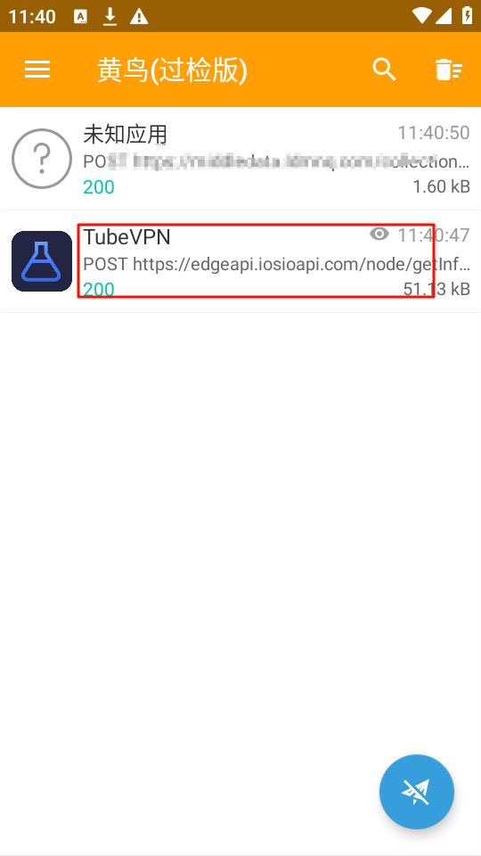
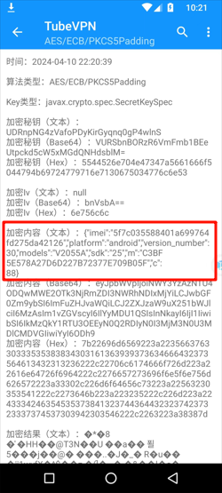
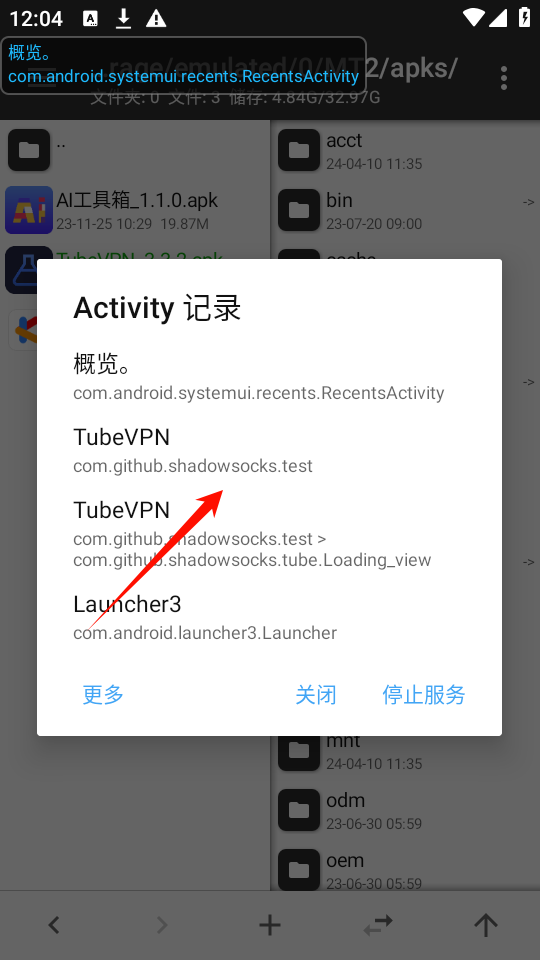
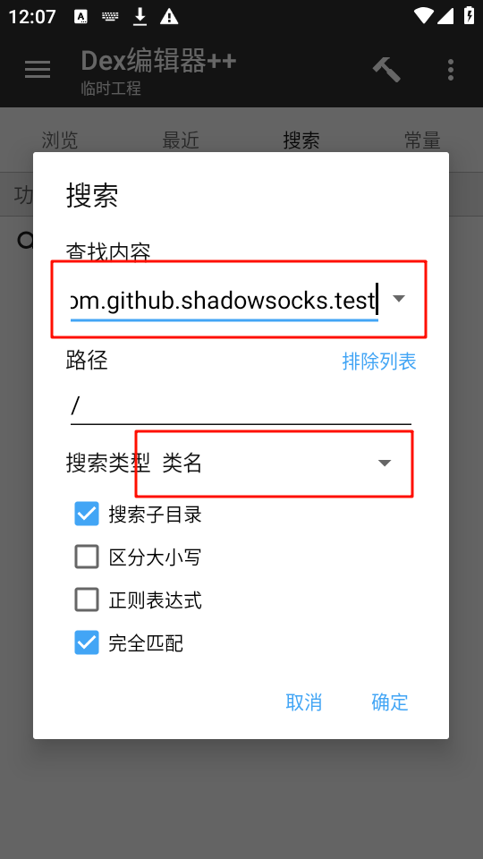

先去官网下载最新版：https://www.tubevpn.cc/
## 开发工具
- 黄鸟
- MT管理器/NP管理器
- 算法助手
## 教程开始
### 打开黄鸟抓包

会看到如下的网络请求

```
请求接口：https://edgeapi.iosioapi.com/node/getInformation_ex
请求参数：t=2024年4月10日11:40:45&value=B88017EF8703D1AD41146FE85033F8C64485C1F13E352F8CABB52344A69D91BE9FDE65EBF16EBDD9A683D3B86E62D7909A5FFB021852AA75B9C8E5B87F317776026658C35E24F8A681C07A06F7285DD9064B94C22CF59018B31C67E5E06B45E9F2C6AEA20B0D1A1228A181F2FC5A9FFEF477FE12DA2BC8DF52CFF894FAD830899B636B2D5BD2D87C209F970A5AF99364CCA9721C259E9E34B87649C2280CAE0B（这里是我虚拟机时间，不准）
请求响应：一坨JSON串
```

OK，看不懂，没关系

### 打开算法助手

PS:这里换手机截的图

**OK，这次看懂了imei是什么意思？** 
国际移动电话设备识别码（International Mobile Equipment Identity）
那就是设备码呗！简单！

### 打开MT管理器

提取安装包->去签名校验->安装新的安装包->打开Activity记录器

进入首页之后，回来就会看到这样的一个Activity


点击复制下来
随便点击一个dex文件->全选->进入（这里不会也去参考上帖）
搜索次类

`com.github.shadowsocks.test` 


进入test，转化Java分析一下(截取部分)
```Java
public void init() { //初始化页面的一些属性
        if (api.getUser(context) != null) {
            inittvBanner();
            userName.setText(api.getUser(context).getEmail());
            email.setText(api.getUser(context).getEmail());
            leftTypename.setText(api.getUser(context).getNodeTypename());
            meunTypename.setText(api.getUser(context).getNodeTypename());
            api.getUser(context);
            if (api.getUser(context).getNodeTypeId() == 1) {
                if (api.isSignIn == 0) {
                    qiandao.setText("在线\n客服");
                } else {
                    qiandao.setText("领取\n时长");
                }
            } else {
                qiandao.setText("在线\n客服");
            }
            leftDate.setText(getDate(api.getUser(context).getMemberData()));
            menuDate.setText(getDate(api.getUser(context).getMemberData()));
            if (api.getUser(context).getAccountModifyLength() == 0) {
                account.setVisibility(8);
                password.setVisibility(0);
            } else {
                account.setVisibility(0);
                password.setVisibility(8);
            }
            ShadowsocksApplication.app.profileId();
            ShadowsocksApplication.app.profileManager.getAllProfiles();
            Profile profile = ShadowsocksApplication.app.profileManager.getProfile(ShadowsocksApplication.app.profileId());
            if (!api.nameBoo) {
                profileName.setText("优选节点");
                intidiqiu("优选节点");
            } else if (profile != null) {
                profileName.setText(profile.name);
                intidiqiu(profile.country);
            }
            initData();
            if (Popup.equals("") || Popup.equals("1")) {
                OnlineService.setText("关闭\n导航");
            } else {
                OnlineService.setText("开启\n导航");
            }
        }
    }

```

```Java
protected void onCreate(Bundle bundle) {
        String str;
        String str2;
        String str3;
        super.onCreate(bundle);
        this.connectionService = new ConnectionService(this);
        this.isDestroyed = false;
        if (bundle != null) {
            onRestoreInstanceState(bundle);
        } else {
            if (LoginActivity.c != null) {
                LoginActivity.c.finish();
            }
            if (!api.loginBoolean) {
                api.notLogin = true;
            }
        }
        setContentView(0x7f0c0089);
        initDrawerLayout();
        context = this;
        Popup = Util.getString(this, "Popup");
        api.setlianTime(context, Long.valueOf(Calendar.getInstance().getTimeInMillis()));
        this.progressDialog = new Loading_view(this, 0x7f120112);
        this.tvBanner = findViewById(0x7f0903a4);
        this.menu_frame = (FrameLayout) findViewById(0x7f09025f);
        ImageView imageView = (ImageView) findViewById(0x7f09030f);
        this.sidebar = imageView;
        imageView.setOnClickListener(new test$17(this));
        ConstraintLayout findViewById = findViewById(0x7f090191);
        this.sidebarzhong = findViewById;
        findViewById.setOnClickListener(new test$18(this));
        userName = (TextView) findViewById(0x7f0903c3);
        email = (TextView) findViewById(0x7f090122);
        profileName = (TextView) findViewById(0x7f0902bb);
        leftTypename = (TextView) findViewById(0x7f0901f5);
        meunTypename = (TextView) findViewById(0x7f090266);
        shuaProfile = (Button) findViewById(0x7f09030e);
        leftDate = (TextView) findViewById(0x7f0901f3);
        menuDate = (TextView) findViewById(0x7f09025e);
        diqiu = (ImageView) findViewById(0x7f0901cf);
        OnlineService = (Button) findViewById(0x7f090008);
        qiandao = (Button) findViewById(0x7f0902c6);
        this.chuguo = findViewById(0x7f0900b5);
        this.huiguo = findViewById(0x7f0901b5);
        this.imglocalimg = (ImageView) findViewById(0x7f0901d1);
        this.imgprivateimg = (ImageView) findViewById(0x7f0901d5);
        this.imglocaltext = (TextView) findViewById(0x7f0900b6);
        this.imgprivatetext = (TextView) findViewById(0x7f0901b6);
        this.chuguo.setOnClickListener(new test$19(this));
        this.huiguo.setOnClickListener(new test$20(this));
        shuaProfile.setOnClickListener(new test$21(this));
        ConstraintLayout findViewById2 = findViewById(0x7f090291);
        this.node_constraint_layout = findViewById2;
        findViewById2.setOnClickListener(new test$22(this));
        Button button = (Button) findViewById(0x7f090008);
        button.setOnClickListener(new test$23(this, button));
        ((LinearLayout) findViewById(0x7f090304)).setOnClickListener(new test$24(this));
        ((LinearLayout) findViewById(0x7f0900f4)).setOnClickListener(new test$25(this));
        findViewById(0x7f09018f).setOnClickListener(new test$26(this));
        qiandao.setOnClickListener(new test$28(this, new test$27(this)));
        LinearLayout linearLayout = (LinearLayout) findViewById(0x7f090013);
        linearLayout.setOnClickListener(new test$29(this));
        linearLayout.setVisibility(8);
        LinearLayout linearLayout2 = (LinearLayout) findViewById(0x7f090009);
        linearLayout2.setOnClickListener(new test$30(this));
        linearLayout2.setVisibility(8);
        LinearLayout linearLayout3 = (LinearLayout) findViewById(0x7f09000b);
        linearLayout3.setOnClickListener(new test$31(this));
        linearLayout3.setVisibility(8);
        ((LinearLayout) findViewById(0x7f0903d5)).setOnClickListener(new test$32(this));
        LinearLayout linearLayout4 = (LinearLayout) findViewById(0x7f0902a6);
        password = linearLayout4;
        linearLayout4.setOnClickListener(new test$33(this));
        LinearLayout linearLayout5 = (LinearLayout) findViewById(0x7f090036);
        account = linearLayout5;
        linearLayout5.setOnClickListener(new test$34(this));
        ((LinearLayout) findViewById(0x7f090306)).setOnClickListener(new test$35(this));
        ((LinearLayout) findViewById(0x7f090210)).setOnClickListener(new test$36(this));
        ConstraintLayout findViewById3 = findViewById(0x7f09018e);
        this.group281_constraint_layout = findViewById3;
        findViewById3.setOnClickListener(new test$37(this));
        this.versionCode = AppUtils.getVersionCode(context);
        Login login = (Login) Util.getObj(this, "account", Login.class);
        if (!api.loginBoolean) {
            str = "/node/getInformation_ex";
            if (login == null) {
                if (api.notLogin) {
                    HttpUtil.isDNS = true;
                    showProgressDialog();
                    String deviceId = api.getDeviceId(this);
                    JSONObject jSONObject = new JSONObject();
                    try {
                        jSONObject.put("imei", deviceId);
                        jSONObject.put("platform", "android");
                        jSONObject.put("version_number", this.versionCode);
                        jSONObject.put("models", api.getSystemModel());
                        jSONObject.put("sdk", api.getSystemVersion());
                        jSONObject.put("m", Util.mmd5(api.getSign(context)));
                        jSONObject.put("c", 88);
                    } catch (JSONException e) {
                        e.printStackTrace();
                    }
                    String encode = AES.encode(jSONObject.toString(), "UDRnpNG4zVafoPDyKirGyqnq0gP4wlnS");
                    HashMap hashMap = new HashMap();
                    hashMap.put("value", encode);
                    hashMap.put("t", date());
                    StringBuilder sb = new StringBuilder();
                    sb.append(api.Url);
                    str2 = str;
                    sb.append(str2);
                    HttpUtil.Post_Async(sb.toString(), this.handlerUI, hashMap, this);
                }
                str2 = str;
            } else {
                str2 = str;
                if (api.notLogin) {
                    HttpUtil.isDNS = true;
                    showProgressDialog();
                    JSONObject jSONObject2 = new JSONObject();
                    try {
                        str3 = "imei";
                    } catch (JSONException e2) {
                        e = e2;
                        str3 = "imei";
                    }
                    try {
                        jSONObject2.put("account", login.getAccount());
                        jSONObject2.put("password", login.getPassword());
                        jSONObject2.put("platform", "android");
                        jSONObject2.put("version_number", this.versionCode);
                        jSONObject2.put("models", api.getSystemModel());
                        jSONObject2.put("sdk", api.getSystemVersion());
                        jSONObject2.put("m", Util.mmd5(api.getSign(context)));
                        jSONObject2.put("c", 88);
                    } catch (JSONException e3) {
                        e = e3;
                        e.printStackTrace();
                        String encode2 = AES.encode(jSONObject2.toString(), "UDRnpNG4zVafoPDyKirGyqnq0gP4wlnS");
                        HashMap hashMap2 = new HashMap();
                        hashMap2.put("value", encode2);
                        hashMap2.put("t", date());
                        HttpUtil.Post_Async(api.Url + str2, this.handlerUI, hashMap2, this);
                        handlerRefresh1 = new test$38(this);
                        handlerRefresh = new test$39(this);
                        WaveProgress findViewById4 = findViewById(0x7f0903d2);
                        this.wave_progress_bar = findViewById4;
                        findViewById4.setEnabled(true);
                        this.wave_progress_bar.setOnClickListener(new test$40(this));
                        if (api.notLogin) {
                        }
                        attachService();
                        if (bundle == null) {
                        }
                    }
                    String encode22 = AES.encode(jSONObject2.toString(), "UDRnpNG4zVafoPDyKirGyqnq0gP4wlnS");
                    HashMap hashMap22 = new HashMap();
                    hashMap22.put("value", encode22);
                    hashMap22.put("t", date());
                    HttpUtil.Post_Async(api.Url + str2, this.handlerUI, hashMap22, this);
                    handlerRefresh1 = new test$38(this);
                    handlerRefresh = new test$39(this);
                    WaveProgress findViewById42 = findViewById(0x7f0903d2);
                    this.wave_progress_bar = findViewById42;
                    findViewById42.setEnabled(true);
                    this.wave_progress_bar.setOnClickListener(new test$40(this));
                    if (api.notLogin) {
                    }
                    attachService();
                    if (bundle == null) {
                    }
                }
            }
        } else if (api.notLogin) {
            init();
            Contrastjudge();
            startService();
            str = "/node/getInformation_ex";
            if (api.getUser(context).getGive_login_time() == 1) {
                if (!isFinishing()) {
                    Dialogv("提示", "获得首日赠送一天时长");
                }
            } else if (api.getUser(context).getGive_login_time() == 2) {
                if (!isFinishing()) {
                    Dialogv("提示", "获得每日30分钟时长");
                }
            } else if (api.getUser(context).getGive_login_time() == 3) {
                if (!isFinishing()) {
                    Dialogv("提示", "获得首日赠送一天时长");
                }
            } else {
                api.getUser(context).getGive_login_time();
            }
            api.notLogin = false;
            str2 = str;
        } else {
            str3 = "imei";
            str2 = "/node/getInformation_ex";
            handlerRefresh1 = new test$38(this);
            handlerRefresh = new test$39(this);
            WaveProgress findViewById422 = findViewById(0x7f0903d2);
            this.wave_progress_bar = findViewById422;
            findViewById422.setEnabled(true);
            this.wave_progress_bar.setOnClickListener(new test$40(this));
            if (api.notLogin) {
                SSRSubUpdateJob.schedule();
            }
            attachService();
            if (bundle == null) {
                if (api.getUser(context) != null && api.listhui != null && api.listchu != null && api.listhuipu != null && api.listhuigao != null && api.listchupu != null && api.listchugao != null) {
                    init();
                    Contrastjudge1();
                    startService();
                    if (load) {
                        isConnect = true;
                        load = true;
                        this.wave_progress_bar.setValue(100.0f);
                        this.wave_progress_bar.time();
                        this.wave_progress_bar.setDownloadComplete(true);
                        isConnect = false;
                        return;
                    }
                    return;
                }
                api.notLogin = true;
                showProgressDialog();
                String deviceId2 = api.getDeviceId(this);
                JSONObject jSONObject3 = new JSONObject();
                try {
                    jSONObject3.put(str3, deviceId2);
                    jSONObject3.put("platform", "android");
                    jSONObject3.put("version_number", this.versionCode);
                    jSONObject3.put("models", api.getSystemModel());
                    jSONObject3.put("sdk", api.getSystemVersion());
                    jSONObject3.put("m", Util.mmd5(api.getSign(context)));
                    jSONObject3.put("c", 88);
                } catch (JSONException e4) {
                    e4.printStackTrace();
                }
                String encode3 = AES.encode(jSONObject3.toString(), "UDRnpNG4zVafoPDyKirGyqnq0gP4wlnS");
                HashMap hashMap3 = new HashMap();
                hashMap3.put("value", encode3);
                hashMap3.put("t", date());
                HttpUtil.Post_Async(api.Url + str2, this.handlerUI, hashMap3, this);
                return;
            }
            return;
        }
        str3 = "imei";
        handlerRefresh1 = new test$38(this);
        handlerRefresh = new test$39(this);
        WaveProgress findViewById4222 = findViewById(0x7f0903d2);
        this.wave_progress_bar = findViewById4222;
        findViewById4222.setEnabled(true);
        this.wave_progress_bar.setOnClickListener(new test$40(this));
        if (api.notLogin) {
        }
        attachService();
        if (bundle == null) {
        }
    }
```

嘿嘿，发现了，在我们的 onCreate() 方法中存在网络请求"/node/getInformation_ex"并且参数包含
```Java
jSONObject.put("imei", deviceId);
jSONObject.put("platform", "android");
jSONObject.put("version_number", this.versionCode);
jSONObject.put("models", api.getSystemModel());
jSONObject.put("sdk", api.getSystemVersion());
jSONObject.put("m", Util.mmd5(api.getSign(context)));
jSONObject.put("c", 88);
```

这不就是我们上面通过抓包得到的参数吗？！
接上述，imei键是设备码，那么deviceId就是我们需要的了，从代码往上看deviceId是通过api.getDeviceId(this)获取的，那么我们去getDeviceId方法里面看看（先搜索定位->长按->点击》》）
跳转到代码转Java
```Java
public static String getDeviceId(Context context) {
        SharedPreferencesUtils sharedPreferencesUtils = new SharedPreferencesUtils(context, "setting");
        String string = sharedPreferencesUtils.getString("SP_DEVICES_ID");
        if (string == null || string.equals(null) || string == null) {
            string = null;
        } else {
            GetDeviceId.saveDeviceID(string, context);
        }
        if (string == null) {
            string = GetDeviceId.getDeviceId(context);
        }
        if (string.equals("e3f5536a141811db40efd6400f1d0a4e")) {
            long currentTimeMillis = System.currentTimeMillis();
            string = GetDeviceId.getMD5(getNumLargeSmallLetter(32) + currentTimeMillis, false);
        }
        sharedPreferencesUtils.putValues(new SharedPreferencesUtils.ContentValue[]{new SharedPreferencesUtils.ContentValue("SP_DEVICES_ID", string)});
        return string;
    }
```


简单来说就是通过GetDeviceId.getDeviceId(context)方法获取设备ID，getMD5加密得到的设备ID保存到SharedPreferences中，最终在返回。我们直接重写这段代码。
删除原getDeviceId的代码把这段复制进去

```
invoke-static {}, Ljava/util/UUID;->randomUUID()Ljava/util/UUID;
move-result-object v0
invoke-virtual {v0}, Ljava/util/UUID;->toString()Ljava/lang/String;
move-result-object v0
```

### 最终

这里return不要删掉！
这里最后一行return不要删掉！
不要删掉！
这是一个简单生成一个随机的UUID字符串的方法
保存，重新编译
最终每次打开都是一个随机新ID，每个ID可以试用1天，无限白嫖。

### 总结

原包就去官网下载吧
