## 前言

本次教程属于真机操作，电脑远程截图，部分不清晰请见谅！

### 开发工具
- 黄鸟
- Mt管理器 / Np管理器
### 提取

打开学习通 - > 笔记，新建一个笔记- > 打开摄像头- > 识文字
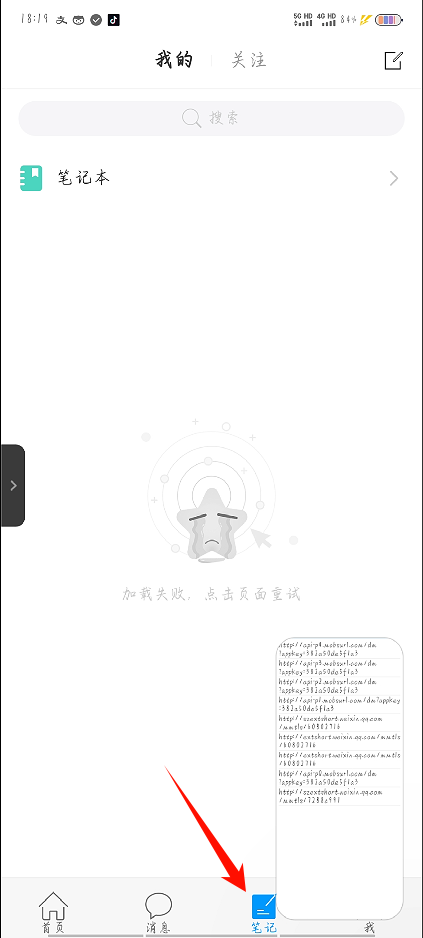
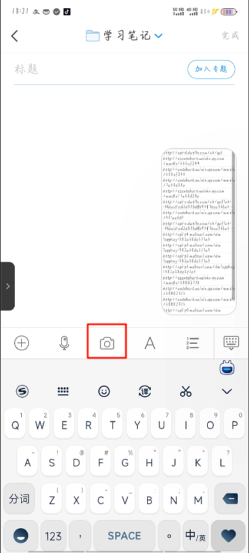
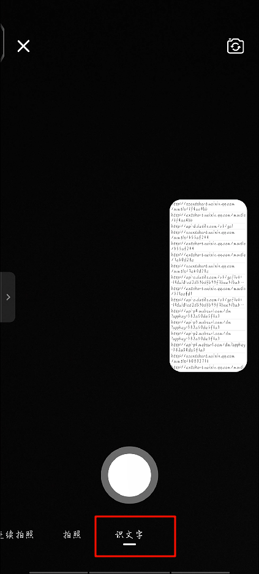
随便拍一个带文字的图片，识别，回到黄鸟会看到这样的请求
`http://ai.chaoxing.com/api/v1/ocr/common/sync`
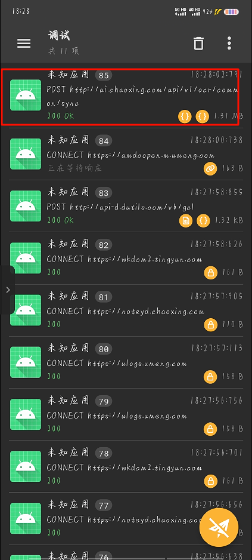
请求头除了中规中矩的熟知外，多了一个CX-Signature
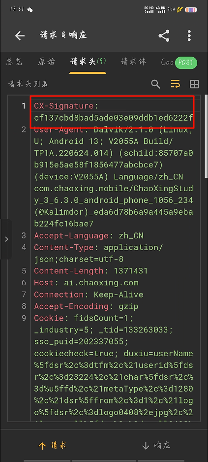
再看一眼请求体，哇，data这一坨应该是base64
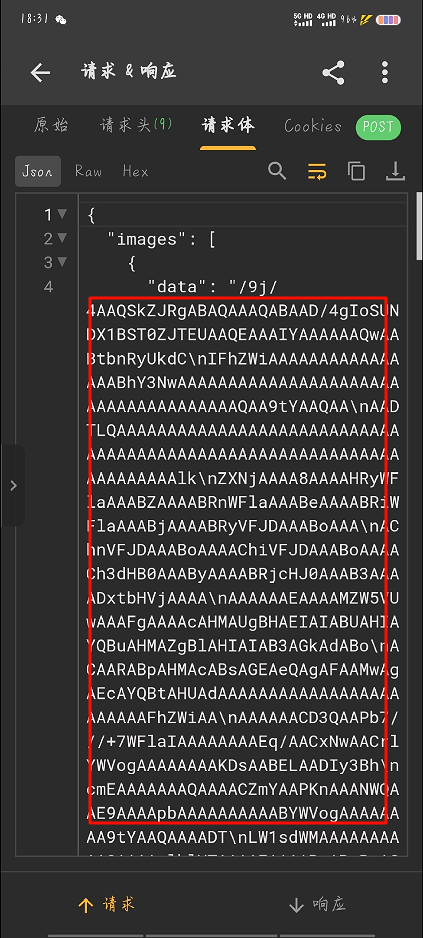
最后看响应体，就是orc提取的文字内容
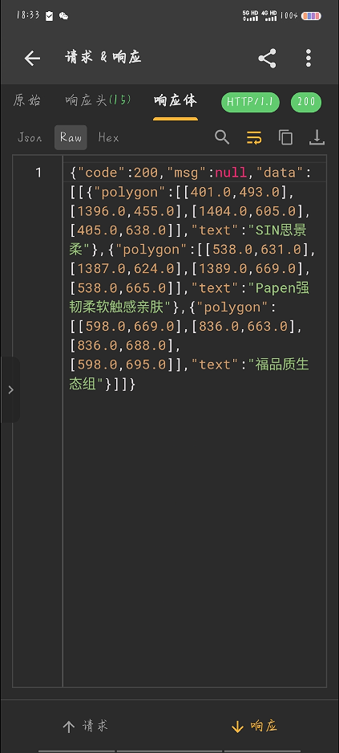
看着倒不难，我们来分析一下。

### 分析学习通

学习通本身自带梆梆加固企业版，我们不需要修复回填，脱壳不难（不会的去找我以前的脱壳帖）。

先去搜索一下：CX-Signature只有一个结果，我们打开看看
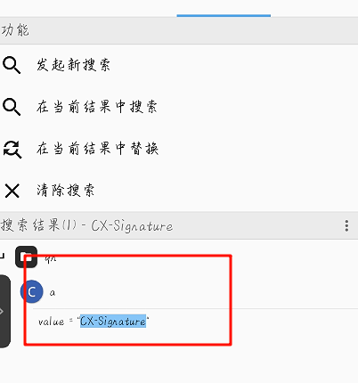
转Java看看
```Java
//
// Decompiled by Jadx - 677ms
//
package qn;

import com.chaoxing.library.data.DataModel;
import com.chaoxing.ocr.core.bean.ImageOcrData;
import f60.i;
import f60.k;
import f60.o;
import java.util.List;
import okhttp3.RequestBody;
import retrofit2.b;

public interface a {
    public static final String a = "http://ai.chaoxing.com/";

    @k({"Content-Type:application/json;charset=utf-8"})
    @o("api/v1/ocr/common/sync")
    b<DataModel<List<ImageOcrData>>> a(@f60.a RequestBody requestBody, @i("CX-Signature") String str);
}
```

哦~接口！我们出来，复制一下，继续代码搜索，看看哪里使用过
可以看到新的搜索结果，
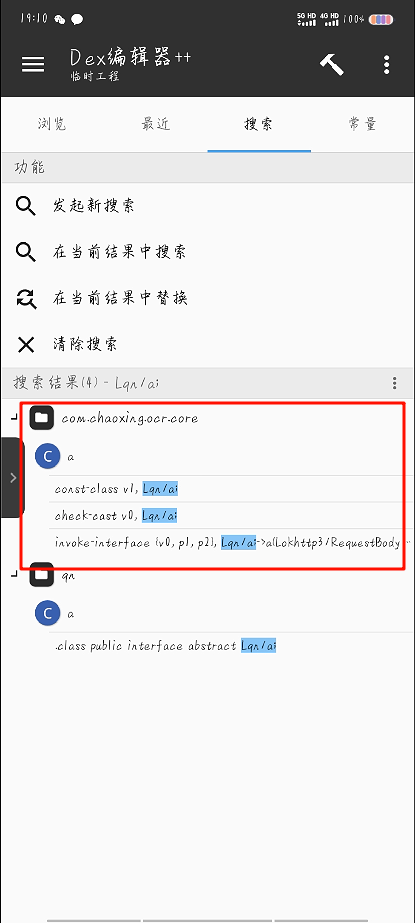
点最长的进去，可以看到，在这个e方法里面调用了这个Lqn/a;->a也就是上面说的接口

```
.method public e(Lokhttp3/RequestBody;Ljava/lang/String;)Lretrofit2/b;
    .registers 5
    .annotation system Ldalvik/annotation/Signature;
        value = {
            "(",
            "Lokhttp3/RequestBody;",
            "Ljava/lang/String;",
            ")",
            "Lretrofit2/b<",
            "Lcom/chaoxing/library/data/DataModel<",
            "Ljava/util/List<",
            "Lcom/chaoxing/ocr/core/bean/ImageOcrData;",
            ">;>;>;"
        }
    .end annotation

    .line 1
    .line 2
    const-string v0, "http://ai.chaoxing.com/"

    .line 3
    .line 4
    .line 5
    invoke-static {v0}, Ls4/e;->e(Ljava/lang/String;)Lt4/f$b;

    .line 6
    move-result-object v0

    .line 7
    .line 8
    new-instance v1, Lcom/chaoxing/ocr/core/a$a;

    .line 9
    .line 10
    .line 11
    invoke-direct {v1, p0}, Lcom/chaoxing/ocr/core/a$a;-><init>(Lcom/chaoxing/ocr/core/a;)V

    .line 12
    .line 13
    .line 14
    invoke-virtual {v0, v1}, Lt4/f$b;->w(Lt4/e;)Lt4/f$b;

    .line 15
    move-result-object v0

    .line 16
    .line 17
    const-class v1, Lqn/a;

    .line 18
    .line 19
    .line 20
    invoke-virtual {v0, v1}, Lt4/f$b;->s(Ljava/lang/Class;)Ljava/lang/Object;

    .line 21
    move-result-object v0

    .line 22
    .line 23
    check-cast v0, Lqn/a;

    .line 24
    .line 25
    .line 26
    invoke-interface {v0, p1, p2}, Lqn/a;->a(Lokhttp3/RequestBody;Ljava/lang/String;)Lretrofit2/b;

    .line 27
    move-result-object p1

    .line 28
    return-object p1
.end method
```

随后我们点导航，长按e方法，查看调用处

OK，有两个结果，我们依次点开看看（第一个没用）
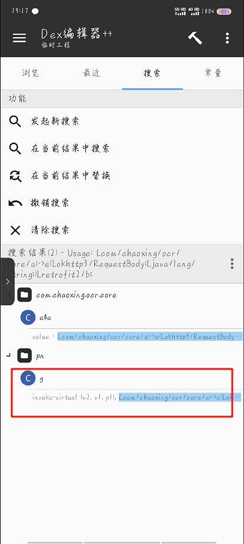
第二个点进去转Java
```Java
//
// Decompiled by Jadx - 532ms
//
package pn;

import android.content.Context;
import android.net.Uri;
import androidx.annotation.NonNull;
import androidx.lifecycle.LiveData;
import androidx.lifecycle.MediatorLiveData;
import androidx.lifecycle.MutableLiveData;
import androidx.lifecycle.Transformations;
import com.chaoxing.android.file.UriFile;
import com.chaoxing.android.util.a;
import com.chaoxing.library.async2.CallData;
import com.chaoxing.ocr.core.RequestParams;
import com.chaoxing.ocr.core.bean.ImageParams;
import com.chaoxing.ocr.model.ImageOcrResult;
import java.util.ArrayList;
import okhttp3.MediaType;
import okhttp3.RequestBody;
import pn.b;
import s9.f;
import s9.k;

public class g extends b.a<ImageOcrResult> {
    public RequestParams i(ImageParams imageParams) throws Throwable {
        ArrayList arrayList = new ArrayList();
        ImageParams.OcrImage ocrImage = new ImageParams.OcrImage();
        String scheme = ((b.a) this).b.getScheme();
        if (scheme != null && (scheme.toLowerCase().startsWith("http") || scheme.toLowerCase().startsWith("https"))) {
            ocrImage.data = ((b.a) this).b.toString();
            ocrImage.type = 1;
        } else {
            UriFile a = UriFile.factory().a(((b.a) this).a, ((b.a) this).b);
            if (a == null) {
                return RequestParams.createError("找不到该图片");
            }
            if (a.length() > 5242880) {
                return RequestParams.createError("图片大小不能超过5M");
            }
            String b = a.b(((b.a) this).a, ((b.a) this).b);
            if (f.c(b)) {
                return RequestParams.createError("图片数据转换异常(B)");
            }
            ocrImage.data = b;
            ocrImage.type = 2;
        }
        ocrImage.dataId = ((b.a) this).c;
        arrayList.add(ocrImage);
        imageParams.setImages(arrayList);
        String g = j9.a.g(imageParams);
        if (f.c(g)) {
            return RequestParams.createError("图片数据转换异常(J)");
        }
        String c = k.c(g + "43e7a66431b14c8f856a8e889070c19b");
        if (f.c(c)) {
            return RequestParams.createError("图片数据转换异常(M)");
        }
        return RequestParams.createSuccess(g, c);
    }

    public static RequestParams j(CallData callData) {
        if (callData != null) {
            return (RequestParams) callData.getData();
        }
        return null;
    }

    public LiveData<ImageOcrResult> a() {
        MediatorLiveData mediatorLiveData = new MediatorLiveData();
        LiveData<RequestParams> g = g(h());
        mediatorLiveData.addSource(g, new f(this, mediatorLiveData, g));
        return mediatorLiveData;
    }

    public final LiveData<RequestParams> g(ImageParams imageParams) {
        return Transformations.map(d9.a.c(new d(this, imageParams)).execute(), new e());
    }

    public final ImageParams h() {
        ImageParams imageParams = new ImageParams();
        if (f.m(((b.a) this).d)) {
            ImageParams.OcrUser ocrUser = new ImageParams.OcrUser();
            ocrUser.account = ((b.a) this).d;
            imageParams.setUser(ocrUser);
        }
        imageParams.setSecretId("Inner_40731a6efece4c2e992c0d670222e6da");
        imageParams.setNonce((int) (Math.random() * 100000.0d));
        imageParams.setTimestamp(System.currentTimeMillis());
        return imageParams;
    }

    public final LiveData<ImageOcrResult> l(RequestParams requestParams) {
        MutableLiveData mutableLiveData = new MutableLiveData();
        com.chaoxing.ocr.core.a.c().e(RequestBody.create(MediaType.parse("application/json; charset=utf-8"), requestParams.getJson()), requestParams.getSignature()).e(new a(this, mutableLiveData));
        return mutableLiveData;
    }

    public g(@NonNull Context context, @NonNull Uri uri) {
        super(context, uri);
    }

    public void k(MediatorLiveData mediatorLiveData, LiveData liveData, RequestParams requestParams) {
        String str;
        mediatorLiveData.removeSource(liveData);
        if (requestParams != null && requestParams.isSuccess()) {
            mediatorLiveData.addSource(l(requestParams), new c(mediatorLiveData));
            return;
        }
        ImageOcrResult imageOcrResult = new ImageOcrResult();
        if (requestParams != null) {
            str = requestParams.getMsg();
        } else {
            str = "图片数据转换异常";
        }
        imageOcrResult.setMsg(str);
        mediatorLiveData.postValue(imageOcrResult);
    }
}
```

回去抓包重新看看请求体。案情明了了！
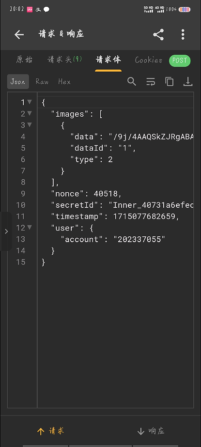
### 请求体

就是

- data 是图片文件的 Base64 格式
- type 不是2就是1
- nonce 是随机的数字
- secretId 固定是 Inner_40731a6efece4c2e992c0d670222e6da
- timestamp 是当前的时间戳

对于Headers，Content-Type 就是application/json; charset=utf-8
### CX-Signature

看我们的e方法，第二个参数是requestParams.getSignature()我们调转getSignature方法所在的类看看，转Java如下


```Java
//
// Decompiled by Jadx - 650ms
//
package com.chaoxing.ocr.core;

import android.os.Parcel;
import android.os.Parcelable;

public class RequestParams implements Parcelable {
    public static final Parcelable.Creator<RequestParams> CREATOR = new a();
    private transient String json;
    private String msg;
    private transient String signature;
    private boolean success;

    private RequestParams() {
    }

    @Override
    public int describeContents() {
        return 0;
    }

    public RequestParams(Parcel parcel) {
        this.success = parcel.readByte() != 0;
        this.msg = parcel.readString();
    }

    public static RequestParams createError(String str) {
        RequestParams requestParams = new RequestParams();
        requestParams.success = false;
        requestParams.msg = str;
        return requestParams;
    }

    public static RequestParams createSuccess(String str, String str2) {
        RequestParams requestParams = new RequestParams();
        requestParams.success = true;
        requestParams.json = str;
        requestParams.signature = str2;
        return requestParams;
    }

    public String getJson() {
        return this.json;
    }

    public String getMsg() {
        return this.msg;
    }

    public String getSignature() {
        return this.signature;
    }

    public boolean isSuccess() {
        return this.success;
    }

    public void setJson(String str) {
        this.json = str;
    }

    public void setMsg(String str) {
        this.msg = str;
    }

    public void setSignature(String str) {
        this.signature = str;
    }

    public void setSuccess(boolean z) {
        this.success = z;
    }

    @Override
    public void writeToParcel(Parcel parcel, int i) {
        parcel.writeByte(this.success ? (byte) 1 : (byte) 0);
        parcel.writeString(this.msg);
    }
}
```

明显看到RequestParams 里面的createSuccess的第二个参数就是我们要的
回到上一个文件
发现RequestParams.createSuccess(g, c);只有在这里才调用了createSuccess方法，而createSuccess方法的第二个参数是`String c = k.c(g + "43e7a66431b14c8f856a8e889070c19b");` 由一个固定字符串+g生成的，而g则是上面请求体而来了的` String g = j9.a.g(imageParams);` 

### 总和

OK，请求头请求体我们差不多都分析了一下
用Python实现一下看看，识别如下图片以及结果

```
sign:  80bf0f81623ecbace27b3507358652b3
Body: {"images": [{"data": "一坨base64", "dataId": "1", "type": 2}], "nonce": 6356, "secretId": "Inner_40731a6efece4c2e992c0d670222e6da", "timestamp": 1715177170424}
Status Code: 200
Response Body: {"code":200,"msg":null,"data":[[{"polygon":[[3.0,8.0],[214.0,8.0],[214.0,24.0],[3.0,24.0]],"text":"构建新时代中塞命运共同体"},{"polygon":[[1.0,36.0],[262.0,36.0],[262.0,51.0],[1.0,51.0]],"text":"当地时间5月8日上午，习近平和塞尔维亚总统"},{"polygon":[[2.0,58.0],[259.0,58.0],[259.0,70.0],[2.0,70.0]],"text":"武契奇共同宣布深化和提升中塞全面战略伙伴"}]]}
构建新时代中塞命运共同体
当地时间5月8日上午，习近平和塞尔维亚总统
武契奇共同宣布深化和提升中塞全面战略伙伴
```

### 总结

完整实现代码

```Python
import requests
import hashlib
import base64
import json
import random
import time
from typing import Tuple

class OCR:
    @staticmethod
    def make_body_and_sign(image_base64: str) -> Tuple[str, str]:
        body_obj = {
            "images": [
                {
                    "data": image_base64,
                    "dataId": "1",
                    "type": 2
                }
            ],
            "nonce": random.randint(0, 1e5),
            "secretId": "Inner_40731a6efece4c2e992c0d670222e6da",
            "timestamp": int(time.time() * 1000)
        }
        body = json.dumps(body_obj)
        text = body + '43e7a66431b14c8f856a8e889070c19b'
        sign = hashlib.md5(text.encode('utf-8')).hexdigest()
        print("sign: " , sign)
        return body, sign

    @staticmethod
    def get_result(image_path: str) -> str:
        with open(image_path, "rb") as image_file:
            encoded_string = base64.b64encode(image_file.read()).decode('utf-8')
        body, sign = OCR.make_body_and_sign(encoded_string)
        headers = {
            'CX-Signature': sign,
            'Content-Type': 'application/json;charset=utf-8'
        }
        print("Body:", body)
        res = requests.post('http://ai.chaoxing.com/api/v1/ocr/common/sync', data=body, headers=headers)
        print("Status Code:", res.status_code)  # 打印状态码
        print("Response Body:", res.text)  # 打印响应内容
        try:
            data = res.json()
            result = '\n'.join(i['text'] for i in data['data'][0])
            return result
        except Exception as e:
            print("Error while parsing response:", e)
            return ""

# 替换成你的图片文件路径

image_path = 'D:\\Desktop\\Projects\\Python22\\Pyproject2\\abc.png'

result = OCR.get_result(image_path)

print(result)
```